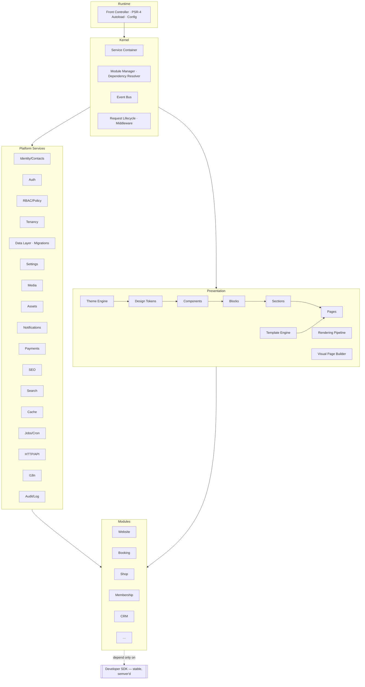

# 01 — Architecture (Master Blueprint)

**Status:** Draft · **Applies to:** Slate v1.x → v5.x · **Anchor document**

This is the master architectural reference. It defines the layer model, what each
layer is responsible for, the boundaries between them, and the request lifecycle.
Deep detail for individual layers lives in the sibling documents listed in §9 and
in other hub sections; this document is the map that keeps them coherent.

Read [00-Vision](../00-Vision/) first — this document is how that vision is built.

---

## 1. The shape in one paragraph

Slate is a **modular monolith** organized as **Kernel + Services + Presentation +
Modules**, with a **stable SDK** as the only surface modules touch. The kernel is
domain-agnostic plumbing (a service container, a module manager, an event bus, a
request lifecycle). Services are cross-cutting capabilities with stable interfaces
(Identity, Data, Payments, Media, SEO, Cache…). The presentation subsystem is a
strict render stack (Tokens → Components → Blocks → Sections → Pages, skinned by a
Theme Engine). Modules are guests that compose services and events into verticals
(Website, Booking, Shop, CRM…) and **never reach into each other**. Everything is
resolved through contracts, so any implementation can change without breaking its
consumers.

---

## 2. Layer model

**Dependency direction:** downward/inward only. Modules → SDK → (Services,
Presentation, Kernel). No lateral module-to-module dependency. No lower layer
knows an upper layer exists except through **events** and **extension points**.

---

## 3. Layer responsibilities & boundaries

Concise here; each links to its detailed home. The authoritative
"what-belongs-where" table is in the [hub README](../README.md#layer-boundary-table-what-belongs-where).

### 3.1 Runtime / Bootstrap
Single front controller for all web + API traffic; PSR-4 autoload; immutable
`Config` from env; the `/slate/` base-path resolver; the global error/exception
handler. **Owns** entry + wiring. **Must not** contain domain logic. Replaces
today's per-file `require config.php` entry points. → detail: this section,
[13-Operations](../13-Operations/).

### 3.2 Kernel
The container (lazy, constructor-injection / factory closures), the module manager
(discover, resolve, order, boot, lifecycle), the event bus, and the middleware
pipeline. **Owns** plumbing. **Must not** contain identity, payments, rendering,
or any service logic. → [kernel.md](kernel.md), [request-lifecycle.md](request-lifecycle.md),
[event-system.md](event-system.md), [plugin-architecture.md](plugin-architecture.md).

### 3.3 Service Layer
The platform "standard library": each service is a container-resolved capability
with a stable interface, owning its data and exposing behavior + events. Business
logic lives here; controllers and API are thin. **Boundary:** other code reaches a
service's data only through its interface or its events. → [service-layer.md](service-layer.md),
plus per-service homes ([02-Domain](../02-Domain/) for Identity,
[07-API](../07-API/) for Payments/API, [11-Database](../11-Database/) for Data,
[05-Rendering](../05-Rendering/) for SEO/Assets, [10-Security](../10-Security/)
for Auth/RBAC).

### 3.4 Presentation Subsystem
The render stack — one token vocabulary, one component library, a core block
registry, first-class sections/templates, the Theme Engine, the rendering
pipeline, and the future visual Page Builder. **Boundary:** each layer consumes
only the one below; themes carry *values*, never structure. → all of
[04-Design-System](../04-Design-System/) and [05-Rendering](../05-Rendering/).

### 3.5 Modules
Packaged verticals. Each owns its tables, blocks, routes, and admin UI, and
depends only on the SDK. **Boundary:** a module may only touch tables it owns and
may not reference another module's classes — cross-module needs go through a
capability interface or an event. → [06-SDK](../06-SDK/), [08-Modules](../08-Modules/).

### 3.6 Developer SDK
The stable, semver'd public surface: base classes, capability interfaces, the
manifest schema, scaffolding CLI, the typed event catalogue, testing utilities.
**Boundary:** anything not exposed here is internal and may change freely. →
[06-SDK](../06-SDK/), [03-Standards](../03-Standards/).

---

## 4. Request & response lifecycle (summary)

Full detail in [request-lifecycle.md](request-lifecycle.md). The middleware
pipeline, in order:

1. **Bootstrap** — front controller, autoload, config, error handler.
2. **Cache probe** — full-page cache check (public GETs); hit ⇒ emit & stop.
3. **Tenant resolve** — map host/subpath → tenant; inject tenant context.
4. **Session & Auth** — establish the principal (user / contact / API client).
5. **Route** — match to a module route or a CMS page; 404 via the router.
6. **Authorize** — policy engine decides `can(principal, permission, resource)`.
7. **Dispatch** — thin controller / API resource calls the **service layer**.
8. **Render** — for pages, run the rendering pipeline (§ [05-Rendering](../05-Rendering/)).
9. **Respond** — headers (security, cache), body; store page/fragment cache.
10. **After-response** — dispatch queued events / jobs off the request path.

The *same* lifecycle serves web and API; only steps 7–9 differ (rendered HTML vs
serialized resource).

---

## 5. How modules communicate (the decoupling contract)

Exactly three channels — no others are permitted:

1. **Capability interface (synchronous need).** Resolve a contract from the
   container: `payments = kernel.get(PaymentGateway::class)`. The provider is
   whichever module registered it. Consumers never name a provider class.
2. **Domain event (reaction to a fact).** Subscribe to `order.paid`,
   `contact.created`, `appointment.booked`. Fire-and-forget, many listeners,
   queue-safe.
3. **Extension point (shape shared data).** Contribute to `nav.items`,
   `seo.meta`, `blocks.register`, `sitemap.collect`.

Direct `ClassName::method()` across a module boundary, or reading/writing another
module's tables, is an **architecture violation** — caught in review and,
eventually, by tooling. This rule is what makes 50+ modules tractable. (ADR-0005.)

---

## 6. Cross-cutting concerns & where they live

| Concern | Home | One-line rule |
|---|---|---|
| Multi-tenancy | [multi-tenancy.md](multi-tenancy.md) | `tenant_id` auto-scoped by the base repository; opt out is explicit + audited |
| Identity | [02-Domain](../02-Domain/) | one Contact, many module profiles keyed by `contact_id` |
| Money | [11-Database](../11-Database/) | `Money` value object (integer minor units); no floats/DECIMAL for money |
| Caching | [13-Operations](../13-Operations/) | four internal tiers + edge; tag-invalidated on writes |
| Security | [10-Security](../10-Security/) | authn ≠ authz; policy engine is the single decision point |
| Errors | [10-Security](../10-Security/) | never leak to users; structured, logged, correlation-id'd |
| Events | [event-system.md](event-system.md) | events are facts (past tense); filters shape data (present tense) |
| Migrations | [11-Database](../11-Database/) | versioned/ordered/reversible; replaces `ensureSchema()` self-heal |

---

## 7. Architectural invariants (must always hold)

These are testable rules the platform must never violate. Later, lint/CI should
enforce them.

1. No module references another module's class or table.
2. Every persistence call is tenant-scoped unless explicitly `crossTenant()`.
3. Money is always a `Money` value object end to end.
4. A person is exactly one `contacts` row; modules attach profiles, never copies.
5. Every request resolves services from the container — no `new` across a boundary.
6. Every public-facing render goes through the one rendering pipeline.
7. Payments flow only through the `PaymentGateway` contract; no module calls a
   provider SDK directly.
8. The SDK surface changes only under the BC policy ([03-Standards](../03-Standards/)).

---

## 8. Decision records (ADR index)

Every major decision is recorded in [14-ADR](../14-ADR/) with context,
alternatives, and consequences. The founding set:

| ADR | Decision |
|---|---|
| ADR-0001 | Flat PHP over a full framework (Laravel/Symfony) |
| ADR-0002 | Modular monolith over microservices |
| ADR-0003 | Server-rendered + progressive enhancement over SPA; no build step |
| ADR-0004 | Kernel + service container + capability contracts |
| ADR-0005 | Events + contracts for inter-module communication (no cross-module class/table access) |
| ADR-0006 | Unified Identity/Contacts model (collapse the parallel person tables) |
| ADR-0007 | Section/Block content model before a visual Page Builder |
| ADR-0008 | One design-token vocabulary shared by admin + public |
| ADR-0009 | Semver'd SDK with a formal backward-compatibility policy |
| ADR-0010 | Migration framework over `ensureSchema()` self-heal |
| ADR-0011 | `Money` value object (integer minor units) platform-wide |
| ADR-0012 | Swappable driver interfaces (cache/queue/tenancy/search) for shared-hosting↔enterprise |
| ADR-0013 | Namespace strategy & `src/` layout (`Slate\…` → `src/`, 10 layer-aligned namespaces) |

---

## 9. Detailed architecture documents

- [kernel.md](kernel.md) — container, module manager, boot, service resolution
- [request-lifecycle.md](request-lifecycle.md) — the middleware pipeline in full
- [service-layer.md](service-layer.md) — service pattern, registration, contracts
- [event-system.md](event-system.md) — events vs filters, the typed catalogue
- [plugin-architecture.md](plugin-architecture.md) — module lifecycle, contracts,
  dependency resolution, isolation enforcement
- [multi-tenancy.md](multi-tenancy.md) — tenant resolution, scoping, storage
  strategies

Sibling sections carry the rest: Data ([11](../11-Database/)), Security
([10](../10-Security/)), Rendering ([05](../05-Rendering/)), SDK ([06](../06-SDK/)),
API ([07](../07-API/)), Domain ([02](../02-Domain/)).
