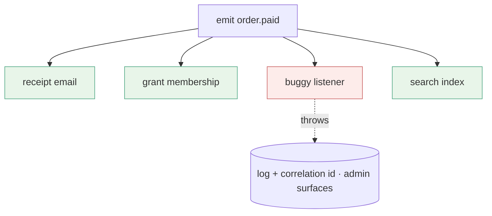
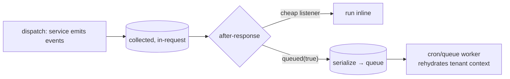

# 01 — Event System (Events vs Filters)

**Status:** Draft · **Applies to:** Slate v1.x → v5.x

The event bus is the **primary channel between modules**. This document draws the
sharp line the platform depends on — **events are past-tense facts; extension
points (filters) are present-tense value pipelines** — specifies the typed event
catalogue, priority, error isolation, and queue-safety, and contrasts today's
single, untyped global hook system.

The bus is owned by the [kernel](kernel.md#3-the-module-manager); this document is
its contract. It realizes *Kernel + Contracts + Modules* ([00-Vision
§3](../00-Vision/README.md)) and ADR-0005, and is the mechanism behind
[01-Architecture §5](README.md#5-how-modules-communicate-the-decoupling-contract)
channels 2 and 3.

---

## 1. What the event system replaces

Today there is **one** mechanism — `Hook::addAction()` / `addFilter()` on bare
string names — used for everything, WordPress-style. It works, but it conflates
two very different jobs and gives no typing, no catalogue, and no async. The
problems this document fixes:

| Today | Consequence | Event-system answer |
|---|---|---|
| `Hook::addAction('order_paid', …)` — bare string, arbitrary args | Typos silently no-op; no discoverability; no contract | **Typed event objects** in a published catalogue ([SDK](../06-SDK/)) |
| Actions and filters are the same `Hook` API | "Is this a fact or a value pipeline?" is unanswerable | Two distinct APIs — `emit(Event)` vs `filter(point, value)` |
| A listener throws → the dispatching request dies | One plugin's bug breaks another's flow | **Per-listener error isolation** (§6) |
| Reminder/receipt email sent **inside** the listener | Slow requests, no retry, lost on crash | **Queue-safe events** dispatched after-response (§7) |
| No priority beyond registration order | Fragile ordering by load accident | **Explicit integer priority** (§5) |
| No record of who listens to what | Impossible to reason about side-effects | Catalogue + subscription manifest (§4) |

The bus keeps the **exception-isolated dispatch** property the current `Hook`
system already has, and formalizes the rest.

---

## 2. The sharp line: facts vs pipelines

Two mechanisms, never confused:

| | **Event** (a fact) | **Extension point / filter** (a pipeline) |
|---|---|---|
| Tense | **Past** — `order.paid`, `contact.created` | **Present** — `seo.meta`, `nav.items` |
| Purpose | announce something *happened* | let contributors *shape* a shared value |
| Return | **nothing** — fire-and-forget | the (possibly modified) value, passed on |
| Listeners | many, **order-independent**, side-effects only | many, **order-dependent**, each transforms the value |
| Timing | may run **after-response / on a queue** | **synchronous** — the caller needs the result now |
| If one fails | isolated, logged, others still run | logged; pipeline continues with the last good value |
| Analogy | a broadcast | a `reduce()` |

**The test:** *"Does the caller need a value back right now?"* Yes → it's a
filter. No, you're reacting to something that already happened → it's an event.
`order.paid` is a fact (send a receipt, grant access, index it — none block the
buyer). `seo.meta` is a pipeline (the page is being built *now* and needs the
merged tags).

```php
// FACT — announce and move on. No return.
$bus->emit(new OrderPaid($order->id, $order->tenantId, $order->total()));

// PIPELINE — collect and fold contributions into a value the caller uses now.
$meta = $bus->filter('seo.meta', $defaultMeta, context: $page);
```

---

## 3. The bus contract

```php
interface EventBus
{
    /** Announce a fact. Returns nothing. Listeners are side-effect only. */
    public function emit(Event $event): void;

    /** Run a value through an ordered pipeline of contributors; returns the result. */
    public function filter(string $point, mixed $value, mixed ...$context): mixed;

    /** Subscribe to a typed event (usually declared in the manifest, not here). */
    public function on(string $eventType, callable $listener, int $priority = 100): void;

    /** Contribute to an extension point. */
    public function extend(string $point, callable $contributor, int $priority = 100): void;
}
```

`Event` is a small immutable object — a typed payload plus envelope metadata the
bus stamps (name, `tenant_id`, `request_id`, timestamp):

```php
interface Event
{
    public function name(): string;        // e.g. "order.paid" — the catalogue key
    public function tenantId(): int;        // stamped for scoping + queue safety (§7)
}

final class OrderPaid implements Event
{
    public function __construct(
        public readonly int   $orderId,
        public readonly int   $tenantId,
        public readonly Money $total,       // Money, always — invariant 3
    ) {}
    public function name(): string { return 'order.paid'; }
    public function tenantId(): int { return $this->tenantId; }
}
```

---

## 4. The typed event catalogue

Events are **not** ad-hoc strings; each is a published, versioned type in the
[SDK event catalogue](../06-SDK/). The catalogue is what makes side-effects across
50+ modules discoverable and safe to subscribe to. Naming is
`domain.pastTenseVerb`. A representative slice:

| Event | Emitted by | Typical listeners |
|---|---|---|
| `contact.created` | Identity | membership, CRM, notifications |
| `order.paid` | Shop / Checkout | notifications, membership, search, audit |
| `appointment.booked` | Booking | notifications (reminders), calendar sync |
| `appointment.cancelled` | Booking | notifications, refunds |
| `payment.captured` / `payment.failed` | Payments (`PaymentGateway`) | order fulfilment, dunning |
| `membership.expired` | Membership | access revocation, win-back email |
| `media.deleted` | Media | usage-reference cleanup |
| `user.login_failed` | Auth | throttling, audit, alerting |

Extension points travel the same catalogue, named `domain.noun`:
`nav.items`, `seo.meta`, `blocks.register`, `sitemap.collect`,
`admin_dashboard_widgets`, `shop.shipping_rates`.

**Subscriptions are declarative.** A module lists what it listens to in its
[manifest](plugin-architecture.md), so the kernel can build the subscription map
in the boot cache **without executing the module** — replacing today's
imperative `Hook::addAction()`-inside-`boot()`:

```jsonc
// manifest.json (excerpt)
"subscribes": [
  { "event": "order.paid",       "handler": "Membership\\Listeners\\GrantAccess", "priority": 100 },
  { "event": "contact.created",  "handler": "Membership\\Listeners\\Welcome",     "priority": 200 }
],
"extends": [
  { "point": "nav.items", "contributor": "Membership\\Nav", "priority": 50 }
]
```

---

## 5. Priority

Both listeners and contributors carry an **explicit integer priority** (lower runs
first; default `100`), so ordering is a declared property, not an accident of
plugin load order.

- **Filters** are *order-sensitive*: a contributor at priority 50 shapes the value
  before one at 200 sees it. This is `reduce()` — sequence matters.
- **Events** are *order-independent by contract*: priority only nudges scheduling
  and must never be relied on for correctness. If listener B needs listener A to
  have run, B is subscribing to the wrong event — A should emit its own follow-up
  fact. **Listeners that depend on each other's ordering are an architecture
  smell.**

---

## 6. Error isolation

Each listener runs in its **own guarded frame**. A listener that throws is
caught, logged with the `request_id` and correlation id, surfaced in the admin,
and the bus **continues to the next listener**. One module's bug can never break
another module's reaction to the same fact — the formalization of the current
"one plugin crashing doesn't take down the shell" property.



Filters isolate too, but with a value to protect: a failing contributor is
skipped and the pipeline proceeds with the **last good value**, so a broken SEO
contributor degrades a page's meta rather than 500-ing it.

---

## 7. Queue-safety (events run off the request path)

Facts should not slow the user. Events raised during
[dispatch](request-lifecycle.md#47-dispatch-thin-controller--api-resource) are
**collected**, and released in the
[after-response stage](request-lifecycle.md#410-after-response) once the client
is served — the structural fix for today's synchronous email sends.

An event is **queue-safe by construction**: because the payload is a small
immutable object carrying its own `tenant_id` (not a live PDO handle or request
globals), a listener can run *inline* after-response **or** be serialized to a
job and run later by the [cron/queue runner](../13-Operations/) — the same
listener code, unchanged.



A listener declares whether it must be deferred:

```jsonc
{ "event": "order.paid", "handler": "Notifications\\SendReceipt", "queued": true }
```

The queue is a **swappable driver** (DB-table default on shared cPanel; Redis on
a VPS — ADR-0012), so queue-safety costs nothing to adopt and scales without
touching a module. **Rules that keep events queue-safe:** payloads are immutable
and self-describing (ids + value objects, never live handles); a listener
re-resolves what it needs from the container under the event's stamped
`tenant_id`; listeners are idempotent, since a queued job may retry.

---

## 8. Boundaries

- **Events carry facts, not commands.** `order.paid`, never `send_order_email` —
  the *name* of a side-effect belongs to the listener, not the emitter. Emitting a
  command-shaped event re-couples the producer to a specific consumer.
- **No return value from an event.** If the caller needs an answer, it wanted a
  filter or a [service call](service-layer.md), not an event.
- **No cross-tenant leakage.** The bus stamps and preserves `tenant_id`; a
  listener runs under the emitting tenant's scope (invariant 2).
- **No ordering-dependence between listeners** (§5).
- **Catalogue-first.** A new event/filter is added to the [SDK
  catalogue](../06-SDK/) before it is emitted, so it is discoverable and versioned
  under the BC policy (invariant 8).

---

## 9. Related documents

- [kernel.md](kernel.md) — owns the bus; compiles subscriptions into the boot cache
- [service-layer.md](service-layer.md) — services emit the facts and honor the filters
- [request-lifecycle.md](request-lifecycle.md) — dispatch collects, after-response releases
- [plugin-architecture.md](plugin-architecture.md) — declarative `subscribes[]` / `extends[]`
- [multi-tenancy.md](multi-tenancy.md) — the tenant scope a queued listener rehydrates
- [06-SDK](../06-SDK/) — the typed event catalogue
- [13-Operations](../13-Operations/) — the queue/cron runner and its drivers
- ADR-0005 (events + contracts), ADR-0012 (swappable drivers)
