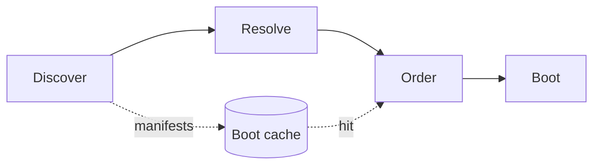
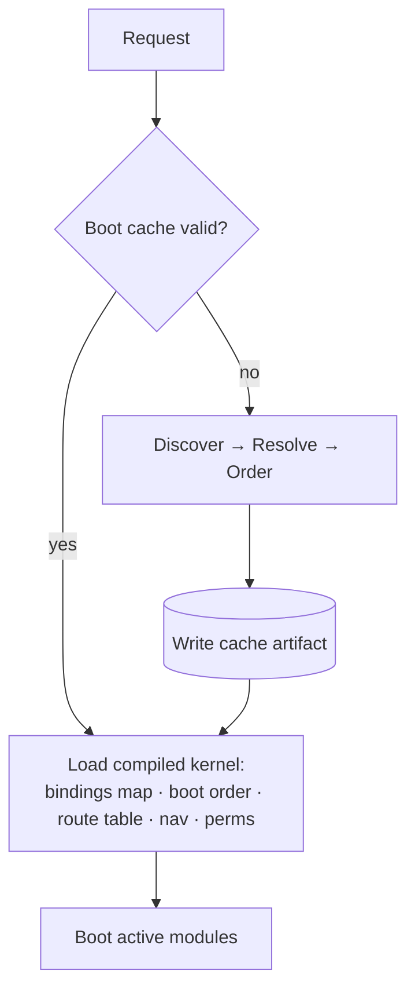

# 01 — Kernel (Container · Module Manager · Boot)

**Status:** Draft · **Applies to:** Slate v1.x → v5.x

The **Kernel** is Slate's domain-agnostic plumbing: a **service container**, a
**module manager**, an **event bus**, and the **request lifecycle**. It wires the
system and contains no business logic (see the [layer-boundary
table](../README.md#layer-boundary-table-what-belongs-where)). This document
specifies the container and the module manager; the event bus is detailed in
[event-system.md](event-system.md), the pipeline in
[request-lifecycle.md](request-lifecycle.md), and the module lifecycle in
[plugin-architecture.md](plugin-architecture.md).

Everything here realizes the *Kernel + Contracts + Modules* principle
([00-Vision §3](../00-Vision/README.md)) and ADR-0004.

---

## 1. What the kernel replaces

Today there is no kernel — there is `config.php` + `PluginLoader`. The concrete
problems this document fixes, from the
[ARCHITECTURE-ROADMAP](../ARCHITECTURE-ROADMAP.md):

| Today | Consequence | Kernel answer |
|---|---|---|
| Global classes, zero namespaces, 691 `require_once` | Name collisions inevitable; coupling is `class_exists`-based | PSR-4 autoload + a container that resolves **interfaces**, not global classes |
| `class_exists('BookingAPI')` to find a capability | Brittle edge on a concrete class; no versioning | `kernel.get(PaymentGateway::class)` resolves whichever module *provides* the capability |
| `SELECT * FROM plugins WHERE status='active'` + `file_get_contents(plugin.json)` + JSON decode **every request** | Death-by-a-thousand-cuts boot cost | A compiled **boot cache**: manifests parsed once, invalidated on change |
| `new Foo()` scattered across files | No single wiring point; untestable | Constructor injection / factory closures; `new` across a boundary is an [invariant](README.md#7-architectural-invariants-must-always-hold) violation |
| Every plugin `boot()` runs eagerly | Linear slowdown as modules grow | Lazy resolution — a service is constructed only when first requested |

The kernel is **not** a rewrite. It is the missing seam that lets the existing
hook system, tenancy columns, and Stripe gateway keep working while modules stop
reaching into each other.

---

## 2. The service container

### 2.1 Contract

The container is **PSR-11-style** (`get(id)` / `has(id)`) with a registration
surface layered on top. `id` is almost always a **capability interface**
class-string; concrete classes are an implementation detail the container hides.

```php
interface Container extends Psr\Container\ContainerInterface
{
    /** Resolve a service by id (usually an interface class-string). */
    public function get(string $id): object;          // PSR-11
    public function has(string $id): bool;             // PSR-11

    /** Bind a lazy factory. Not invoked until first get(). */
    public function bind(string $id, Closure $factory): void;

    /** Bind a shared (singleton) lazy factory — resolved once, cached. */
    public function singleton(string $id, Closure $factory): void;

    /** Bind an already-constructed instance. */
    public function instance(string $id, object $service): void;

    /** Alias an interface to a concrete provider id (capability wiring). */
    public function alias(string $id, string $target): void;

    /** Extend/decorate an existing binding (middleware, wrappers). */
    public function extend(string $id, Closure $decorator): void;
}
```

### 2.2 Lazy by default

Bindings are **factory closures**; nothing is constructed at registration. The
factory receives the container so it can resolve its own dependencies:

```php
$c->singleton(PaymentGateway::class, fn (Container $c) => new StripeGateway(
    $c->get(SettingsService::class),
    $c->get(HttpClient::class),
    $c->get(AuditLog::class),
));
```

`StripeGateway` is built on the **first** `get(PaymentGateway::class)` and cached
for the rest of the request. A request that never touches payments never
constructs it. This is the direct fix for today's eager per-request `boot()`
cost.

### 2.3 Constructor injection

The default wiring style is **constructor injection**: a service declares its
collaborators as constructor parameters, and the factory (hand-written or
autowired) supplies them from the container. Services never call a global,
never `new` a collaborator, and never touch `$_GET`/`$_SESSION` directly — those
arrive as injected request-scoped values (see
[request-lifecycle.md §Context](request-lifecycle.md)).

**Autowiring (optional, dev-time):** for zero-arg or interface-typed
constructors the container may reflectively resolve dependencies, but the boot
cache (§4) always compiles the *explicit* factory list so production never pays
reflection cost.

### 2.4 Scopes

| Scope | Lifetime | Examples |
|---|---|---|
| **Singleton** | Whole request (default for services) | `PaymentGateway`, `SettingsService`, `EventBus` |
| **Transient** | New instance per `get()` | value builders, per-call DTOs |
| **Request-scoped** | Bound once per request by the lifecycle, before dispatch | `TenantContext`, `Principal`, `RequestId` |

Request-scoped bindings are how tenancy and identity reach every service without
a global. The lifecycle binds them as **instances** after the resolve/auth
middleware runs (see [multi-tenancy.md](multi-tenancy.md)).

### 2.5 Resolution rules (invariants)

1. Ambiguity is an error. If two modules `provide` the same capability without a
   declared precedence, the module manager **refuses to boot** and reports the
   conflict — it never silently picks one. (Contrast today's
   `shipping-flat-rate` vs `flat-rate-shipping` both claiming `shop_shipping_rate`.)
2. A missing required capability is a **fatal, named** error at activation, not a
   runtime `class_exists` false. See [plugin-architecture.md
   §Resolver](plugin-architecture.md).
3. Cross-boundary `new` is forbidden ([invariant
   5](README.md#7-architectural-invariants-must-always-hold)); modules receive
   collaborators only via `get()` or injection.

---

## 3. The module manager

The module manager **discovers, resolves, orders, and boots** modules, and drives
their [lifecycle](plugin-architecture.md). It reads the **manifest v2** schema —
declarative `provides[]` / `requires[]` capabilities, routes, nav, permissions,
settings, and event subscriptions — so most wiring is *data the kernel reads
without executing a module*.

### 3.1 The four phases



| Phase | Input | Output | Cost model |
|---|---|---|---|
| **Discover** | `plugins/*/manifest.json` + registry row | Parsed, validated manifests | Cached; re-run only on manifest mtime change or registry version bump |
| **Resolve** | `provides[]`/`requires[]` + version constraints | A capability graph; missing/ambiguous → refuse | Cached with the manifests |
| **Order** | The capability graph | A topological boot order | Cached |
| **Boot** | Ordered, active modules | Registered routes/services/subscriptions | Runs each request, but only `register()` (cheap), not domain work |

### 3.2 Discover

The manager enumerates installed modules and loads each **manifest** — never the
module's PHP. A manifest declares everything the kernel needs to introspect the
system (build the full nav, list every route, compute the permission union)
**without booting a single module**. This is what makes "declarative wiring"
(00-Vision §3.3) real and replaces today's imperative
`Hook::addAction()`-inside-`boot()` registration.

### 3.3 Resolve (capabilities, not classes)

Each module declares:

```jsonc
// manifest.json (excerpt — full schema in plugin-architecture.md)
{
  "id": "shop",
  "provides":  [{ "capability": "Catalog", "version": "1.2.0" }],
  "requires":  [{ "capability": "PaymentGateway", "constraint": "^1.0" },
                { "capability": "Identity",       "constraint": "^1.0" }]
}
```

The manager builds a **capability → provider** map. `PaymentGateway` resolves to
whichever active module provides it (Stripe today, another gateway tomorrow) —
the shop never names `StripeGateway`. This replaces both `class_exists('…API')`
coupling **and** the advisory-only `works_better_with` hint with an enforced
contract.

### 3.4 Order (topological boot)

Boot order is the **topological sort** of the capability graph: a provider boots
before its consumers so that when `shop.boot()` resolves `PaymentGateway`, the
provider is already registered. A cycle is a fatal, reported error. This is the
deterministic replacement for today's "install order decides schema."

### 3.5 Boot

For each active module in order, the manager calls the module's `register()`
(bind services into the container, attach declared event subscriptions). Heavy
work stays lazy — `register()` binds factories, it does not construct services or
run `ensureSchema()`. Schema changes are owned by the **migration framework**
([11-Database](../11-Database/), ADR-0010), not boot.

Boot is **exception-isolated per module** (preserving today's "one plugin
crashing doesn't take down the shell" property): a module that throws in
`register()` is quarantined, logged with a correlation id, and surfaced in the
admin, while the rest of the system boots.

---

## 4. The boot cache

Discovery + resolve + order are **pure functions of the installed manifests**.
They are computed once and cached; each request loads the compiled artifact
instead of scanning the filesystem.



**What is cached:** the parsed manifests, the capability→provider map, the
topological boot order, the merged **route table**, the merged **nav tree**, and
the **permission union**.

**Invalidation key:** a hash of `(registry version, each manifest's mtime+size,
core version)`. Activating/deactivating/upgrading a module bumps the registry
version; editing a manifest changes its mtime — either invalidates the cache.
This is the direct fix for the per-request `plugin.json` read + JSON decode +
`version_compare` loop.

**Driver:** per the optionality principle
([00-Vision §4](../00-Vision/README.md)), the cache is an interface with a
**file/APCu default driver** (shared cPanel hosting) and heavier drivers
(APCu-shared, Redis) available without touching a module (ADR-0012). See
[13-Operations](../13-Operations/).

---

## 5. How a module integrates with the kernel

The kernel is the only thing a module talks to for wiring. The integration
surface is exactly three channels (mirroring [01-Architecture
§5](README.md#5-how-modules-communicate-the-decoupling-contract)):

1. **Provide/consume a capability** — declared in the manifest, resolved through
   the container. `get(PaymentGateway::class)`, never `new StripeGateway()`.
2. **Subscribe to / emit events** — attached declaratively, dispatched by the
   [event bus](event-system.md).
3. **Contribute to extension points** — `nav.items`, `seo.meta`, `blocks.register`.

A minimal module's contract with the kernel:

```php
final class ShopModule implements Module
{
    // Called by the module manager during Boot, in topological order.
    public function register(Container $c): void
    {
        $c->singleton(Catalog::class, fn ($c) => new CatalogService(
            $c->get(Repository::class),      // tenant-scoped data layer
            $c->get(EventBus::class),
        ));
        // Capability the manifest declares this module *provides*:
        $c->alias(Catalog::class, CatalogService::class);
    }
}
```

Everything static about `ShopModule` — its routes, nav entries, permissions,
settings schema, and event subscriptions — lives in the **manifest**, not in
`register()`, so the kernel can build the boot cache without ever calling this
code.

---

## 6. Boundaries (what the kernel must never do)

- **No business logic.** The kernel knows nothing about payments, contacts,
  bookings, or rendering — those are [services](service-layer.md) and
  [modules](plugin-architecture.md).
- **No direct DB access.** The kernel wires the [Data Layer](../11-Database/); it
  does not query.
- **No knowledge of a specific module.** Anything module-specific in the kernel is
  a design bug.
- **No `new` of a service.** The container constructs services; callers resolve
  them.

---

## 7. Related documents

- [request-lifecycle.md](request-lifecycle.md) — how a request flows through the
  booted kernel
- [service-layer.md](service-layer.md) — what the container resolves
- [event-system.md](event-system.md) — the event bus the kernel owns
- [plugin-architecture.md](plugin-architecture.md) — the module lifecycle and
  manifest v2 the module manager drives
- [multi-tenancy.md](multi-tenancy.md) — request-scoped tenant context
- ADR-0004 (kernel + container + contracts), ADR-0012 (swappable drivers) in
  [14-ADR](../14-ADR/)
