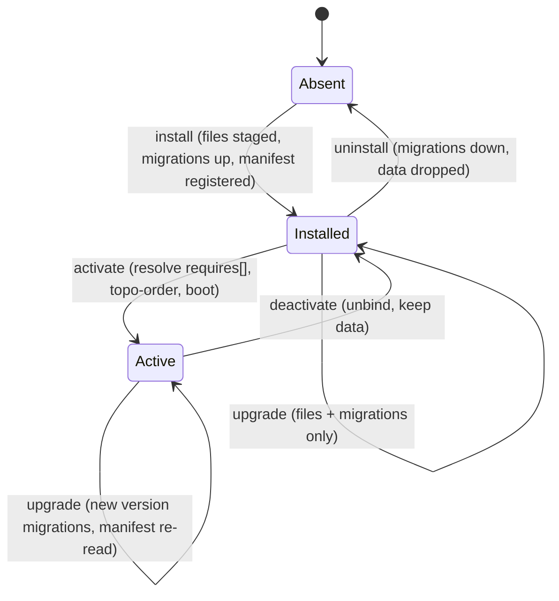

# 01 — Plugin Architecture (Module Lifecycle · Manifest v2 · Dependency Resolver)

**Status:** Draft · **Applies to:** Slate v1.x → v5.x

A **Module** (≡ Plugin; we prefer *Module*) is a packaged vertical that depends on
service **contracts** and **events**, never on another module's classes or tables
(see the [canonical glossary](../README.md#canonical-glossary-fixed-vocabulary)).
This document specifies the **lifecycle** the module manager drives
(install → activate → deactivate → uninstall → upgrade), the **manifest v2** schema
it reads, the **dependency resolver** that orders activation and refuses on a
missing capability, and the **table-ownership isolation** that keeps modules from
colliding in one shared database.

The module manager that runs all of this lives in the
[kernel](kernel.md#3-the-module-manager); this document is its lifecycle and
contract. It realizes *Kernel + Contracts + Modules* and *data over code for
wiring* ([00-Vision §3](../00-Vision/README.md)) and ADR-0004/ADR-0005.

---

## 1. What this replaces

Today a plugin is a folder with `plugin.json`, a `boot()`, an `install.sql`, and an
`ensureSchema()` self-heal. It works, but every seam is a convention rather than a
contract. The concrete problems this document fixes, from the
[AUDIT-BRIEFING](../AUDIT-BRIEFING.md) and the roadmap:

| Today | Consequence | Module-architecture answer |
|---|---|---|
| `works_better_with` is an **advisory** hint with no enforcement | A module activates against a missing dependency and fails at runtime | `requires[]` capabilities with version constraints — a missing provider **refuses activation** (§5) |
| `shipping-flat-rate` and `flat-rate-shipping` both register `shop_shipping_rate` | Silent last-one-wins; "activate at most one" is a *README warning* | `provides[]` capabilities; two providers of one capability is **refused at boot** ([kernel §2.5](kernel.md#25-resolution-rules-invariants)) |
| **Nothing prevents** two plugins from colliding on a table prefix — table ownership is convention, not enforced (today each plugin does own its own prefix, but a collision would be undetected) | A future collision would make ownership ambiguous and let one plugin's uninstall drop another's tables | **Table-ownership isolation** — one prefix, one owner, enforced (§6) |
| `activate()` runs a permission-registration loop that no longer wires anything | Dead code; permissions actually come from the manifest union | Permissions are **declared in the manifest** and merged into the boot-cache union; authorization is the pipeline's single decision point (§4.4, §7) |
| Boot/activation order is unmanaged (a consumer can boot before the provider it needs) | Non-deterministic activation; "it worked on my install" | **Topological** activation order from the capability graph (§5) |
| `boot()` mixes wiring, schema self-heal, and hook registration | Untestable, eager, order-fragile | Lifecycle **phases** separate schema (migrations) from wiring (`register()`) from static data (manifest) (§3) |
| Registry row + `plugin.json` read + JSON decode **every request** | Death-by-a-thousand-cuts boot cost | Manifests compiled once into the [boot cache](kernel.md#4-the-boot-cache) |

This is **not** a rewrite. The ZIP-upload lifecycle, the exception-isolated boot,
the hook-based extension ethos, and the tenancy columns all survive — this document
turns each convention into an enforced contract.

---

## 2. Anatomy of a module

A module is a directory under `plugins/<id>/` with a fixed shape. Everything
*static* about it — what it provides, requires, routes, shows in nav, permits,
settings, and listens to — is **declared in the manifest as data**, so the kernel
can introspect the whole system without executing a single module (00-Vision §3.3).

```
plugins/shop/
├── manifest.json          Manifest v2 — the module's whole static surface (§4)
├── src/                   PSR-4 namespaced classes (ShopModule, services, listeners)
│   └── ShopModule.php      implements Module — register() binds services (kernel §5)
├── migrations/            Versioned, ordered, reversible schema (replaces install.sql
│                          + ensureSchema self-heal — ADR-0010, 11-Database)
├── routes/                Route handlers (thin controllers — service-layer §4)
├── views/                 Blocks, templates, admin pages
└── assets/                Runtime-composed CSS/JS (no build step — ADR-0003)
```

```php
interface Module
{
    /** Called by the module manager during Boot, in topological order.
     *  Binds service factories + attaches declared subscriptions. Cheap; no domain work. */
    public function register(Container $c): void;

    /** Lifecycle hooks (all optional, all idempotent) — see §3. */
    public function onInstall(InstallContext $ctx): void;
    public function onActivate(ActivateContext $ctx): void;
    public function onDeactivate(DeactivateContext $ctx): void;
    public function onUninstall(UninstallContext $ctx): void;
    public function onUpgrade(UpgradeContext $ctx): void;   // from → to version
}
```

`register()` is the *runtime* seam (see [kernel §5](kernel.md#5-how-a-module-integrates-with-the-kernel));
the `on*` hooks are the *lifecycle* seams (§3). Neither runs the schema — migrations
own that (§3.6).

---

## 3. The module lifecycle

A module is a small state machine. The manager persists the state in the registry
and drives every transition; a transition either completes or **rolls back** — a
module is never left half-installed.



> A module is **never uninstalled from Active** — it must be deactivated first, so
> the resolver can verify no *active* consumer still requires its capability (§5).

Each transition below states **WHAT** happens, **WHY** it is a distinct phase, and
**HOW** it stays safe (idempotent + reversible).

### 3.1 Install
- **WHAT:** stage files (cross-filesystem-safe, as today), validate the manifest
  against the v2 schema, run the module's **up** migrations to create its tables,
  and write the registry row in state `Installed`. No services boot; no routes go
  live.
- **WHY separate from activate:** installing is a *filesystem + schema* operation;
  activating is a *wiring* operation. Splitting them means a module's tables exist
  and are migratable even while it is switched off, and reactivation is instant.
- **HOW safe:** migrations are versioned and transactional per step (ADR-0010,
  [11-Database](../11-Database/)); a failed migration rolls the batch back and the
  module stays `Absent`. `bin/package-plugin.php` still validates manifest + SQL
  before the ZIP is trusted (a passing ZIP is guaranteed to install).

### 3.2 Activate
- **WHAT:** the resolver checks every `requires[]` capability is satisfiable by an
  active provider at a compatible version (§5), computes the new topological order,
  merges the module's declared routes/nav/permissions/settings/subscriptions into
  the boot-cache artifacts, calls `onActivate()`, bumps the **registry version**
  (invalidating the boot cache — [kernel §4](kernel.md#4-the-boot-cache)), and moves
  to `Active`.
- **WHY resolver-gated:** activation is the moment a missing or ambiguous capability
  must become a **named, fatal, pre-flight error** — never a runtime `class_exists`
  false. This is the enforcement `works_better_with` never had.
- **HOW safe:** if any `requires[]` is unmet or two modules would `provide` the same
  capability without declared precedence, activation is **refused with a specific
  message** and nothing changes. `onActivate()` is for one-time seeding only (demo
  data, default settings rows) and must be idempotent.

### 3.3 Deactivate
- **WHAT:** the resolver verifies **no active module still requires** a capability
  this module solely provides; if clear, it unbinds the module's services,
  subscriptions, routes, and nav, calls `onDeactivate()`, bumps the registry
  version, and returns to `Installed`. **Data is kept.**
- **WHY reverse-dependency-checked:** deactivating a provider out from under an
  active consumer is the mirror of activating against a missing one — both leave the
  graph inconsistent. The resolver refuses it and names the blocking consumer.
- **HOW safe:** unbinding is pure (the boot cache is recomputed from the surviving
  manifests); the module's tables remain untouched, so reactivation loses nothing.
  Auto-hiding dashboard widgets / nav on deactivate is a property of recomputing the
  cache, not per-module cleanup code.

### 3.4 Uninstall
- **WHAT:** from `Installed` only, run the module's **down** migrations (dropping its
  owned tables), call `onUninstall()`, remove staged files and the registry row, and
  return to `Absent`.
- **WHY down-migrations:** dropping data is destructive and irreversible in a tree
  with no VCS (AUDIT §9). Making it an explicit, reviewed *down* migration — not an
  implicit `DROP` — forces the data-loss decision to be deliberate.
- **HOW safe:** the manager confirms the module is `Installed` (not `Active`) first;
  a **pre-uninstall export hook** lets a module emit its data before its tables go
  (mirroring today's booking GDPR export). Because only the module's **owned**
  prefix is dropped (§6), uninstall can never delete another module's tables.

### 3.5 Upgrade
- **WHAT:** replace files, run any **new** migrations between the installed version
  and the package version in order, re-read the manifest (routes/permissions/etc.
  may have changed), call `onUpgrade(from, to)`, and bump the registry version.
- **WHY a first-class transition:** upgrades are the common case over a decade
  (00-Vision §1). Treating upgrade as "uninstall + install" would destroy data;
  treating it as a no-op ignores schema drift. It is its own reversible phase.
- **HOW safe:** migrations are **forward-only-by-default with a declared down**;
  the manifest's `version` and a `migrations` ledger let the manager compute exactly
  which steps are pending. An upgrade that fails mid-batch rolls back to the prior
  version and its manifest. BC rules for capability versions are in §5 and
  [03-Standards](../03-Standards/).

### 3.6 The lifecycle vs. schema separation

> **Migrations own schema; the lifecycle owns wiring.** No `on*` hook and no
> `register()` runs DDL. This retires the `ensureSchema()` self-heal /
> column-reconcile pattern (ADR-0010): schema changes are versioned, ordered, and
> reversible migration files the *install/upgrade/uninstall* transitions run — never
> per-request boot work. See [11-Database](../11-Database/).

---

## 4. Manifest v2

The manifest is the module's **entire static surface as data**. The kernel reads it
to build the capability graph, the merged route table, the nav tree, the permission
union, the settings schema, and the subscription map — all compiled into the
[boot cache](kernel.md#4-the-boot-cache) **without executing the module**. This is
the "declarative wiring" principle made real; it replaces imperative
`Hook::addAction()`-inside-`boot()` registration.

### 4.1 Full schema (annotated)

```jsonc
{
  "manifest": 2,                       // schema version — v1 plugin.json is auto-shimmed (§4.5)
  "id": "shop",                        // unique module id == directory name
  "name": "Shop",
  "version": "1.3.0",                  // semver — drives upgrade migrations (§3.5)
  "core": "^1.4",                      // core version constraint this module runs against

  // ── Capabilities: the enforced replacement for works_better_with ──
  "provides": [
    { "capability": "Catalog",        "version": "1.2.0" },
    { "capability": "Checkout",       "version": "1.0.0" }
  ],
  "requires": [
    { "capability": "PaymentGateway", "constraint": "^1.0" },   // hard — refuses if unmet (§5)
    { "capability": "Identity",       "constraint": "^1.0" }
  ],
  "optional": [
    { "capability": "ShippingRate",   "constraint": "^1.0" }    // soft — boots without it; feature degrades
  ],

  // ── Declarative wiring: read without booting the module ──
  "routes": [
    { "method": "GET",  "path": "/shop",              "handler": "Shop\\Http\\Storefront@index",
      "permission": null },                                     // public
    { "method": "POST", "path": "/shop/checkout",     "handler": "Shop\\Http\\Checkout@submit",
      "permission": "shop.order.create" }
  ],
  "nav": [
    { "group": "Commerce", "label": "Orders", "route": "admin.shop.orders",
      "permission": "shop.order.view", "priority": 20 }
  ],
  "permissions": [
    { "key": "shop.order.view",   "label": "View orders" },
    { "key": "shop.order.create", "label": "Place orders" }
  ],
  "settings": [
    { "key": "shop.currency", "type": "enum", "options": ["USD","EUR"], "default": "USD" },
    { "key": "shop.tax_rate", "type": "int",  "default": 0, "label": "Tax rate (bps)" }
  ],
  "subscribes": [
    { "event": "payment.captured", "handler": "Shop\\Listeners\\FulfilOrder", "priority": 100 },
    { "event": "payment.failed",   "handler": "Shop\\Listeners\\CancelOrder", "priority": 100, "queued": true }
  ],
  "extends": [
    { "point": "nav.items", "contributor": "Shop\\Nav", "priority": 50 },
    { "point": "seo.meta",  "contributor": "Shop\\Seo", "priority": 60 }
  ],

  // ── Ownership: the module's data namespace (§6) ──
  "owns": { "tables": ["shop_orders", "shop_order_items", "shop_products"] }
}
```

### 4.2 Capabilities: `provides[]` / `requires[]` / `optional[]`

- **WHAT:** a module names the capabilities it *provides* (with a semver `version`)
  and the ones it *requires* (with a semver `constraint`). `optional[]` is a soft
  requirement — the module boots without it and degrades a feature.
- **WHY:** this is the enforced contract that `works_better_with` only *suggested*.
  The kernel brokers **capabilities**, not classes — the shop requires
  `PaymentGateway ^1.0`, never `StripeGateway`, so any conforming provider satisfies
  it and the provider can be swapped in the manifest wiring alone
  ([service-layer §3](service-layer.md#3-interface-first-registration--resolution)).
- **HOW:** the resolver (§5) matches each `requires[].constraint` against an active
  `provides[].version` and builds the capability graph. A version bump on a `provides`
  capability follows the BC policy (invariant 8, [03-Standards](../03-Standards/)).

### 4.3 Routes, nav, settings — declared, not registered

- **WHAT:** routes, nav entries, and the settings schema are **rows of data**, each
  carrying the `permission` it needs. The kernel merges them into the global route
  table, nav tree, and settings registry at cache-build time.
- **WHY:** a route table the kernel can *read* means routing, 404s, and the full nav
  are computed **without booting a module** ([request-lifecycle §4.5](request-lifecycle.md#45-route)).
  Declaring the route's `permission` inline is what lets the pipeline authorize in
  one place (§4.4).
- **HOW:** on activation these merge into the boot cache; on deactivation they vanish
  by recomputation. No module imperatively calls a router or a nav API.

### 4.4 Permissions — declared, enforced by the pipeline

- **WHAT:** a module declares its permission **keys** in `permissions[]`; each route
  declares which key it needs. The kernel folds all active modules' keys into the
  **permission union** in the boot cache.
- **WHY — the dead `activate()` loop:** today a permission-registration loop runs in
  `activate()` but no longer wires anything meaningful; permissions actually come
  from the manifest key union, and the loop is vestigial. Manifest v2 makes the
  declaration the *only* source, and moves the *decision* to the pipeline: the
  [Authorize stage](request-lifecycle.md#46-authorize) evaluates
  `can(principal, permission, resource)` against the route's declared permission.
  **No module runs its own authorization loop** — this is exactly the dead loop the
  [request lifecycle §4.6](request-lifecycle.md#46-authorize) retires, and it upholds
  invariant "authn ≠ authz; policy engine is the single decision point"
  ([10-Security](../10-Security/)).
- **HOW:** activation merges keys into the union and bumps the registry version;
  the policy engine reads the union; controllers never re-check permissions ad hoc.

### 4.5 Backward compatibility with v1 `plugin.json`

- **WHAT:** existing `plugin.json` manifests keep working. A **compatibility shim**
  reads a v1 manifest and projects it onto v2: its `permissions`/`nav`/`routes` map
  directly; a v1 `works_better_with` hint becomes an `optional[]` capability (never a
  hard `requires[]`, so an old plugin can't newly refuse to activate); a plugin with
  no declared capabilities simply `provides[]`/`requires[]` nothing.
- **WHY:** *reveal, don't rebuild* (00-Vision §2) and the BC policy (ADR-0009) —
  19 shipped plugins must not break on the day v2 lands.
- **HOW:** the shim runs at Discover; authors migrate to native v2 to gain enforced
  dependencies and table ownership. The `manifest: 2` key selects the native schema.

---

## 5. The dependency resolver

The resolver turns declared capabilities into a **boot order** and refuses any graph
it cannot satisfy. It runs at the **Resolve** and **Order** phases the
[kernel](kernel.md#31-the-four-phases) defines, and its result is cached until a
manifest or the registry version changes.

### 5.1 What it computes

```
INPUT:   active modules' manifests (provides[], requires[], optional[], owns)
BUILD:   capability → provider   (each capability mapped to exactly one active provider)
CHECK:   for every requires[c, constraint]:
            provider = map[c]
            FAIL "unmet requirement"   if provider is absent
            FAIL "version conflict"    if provider.version ∤ constraint
         for every capability c with >1 provider and no declared precedence:
            FAIL "ambiguous provider"
         for every owns.tables prefix claimed by >1 module:
            FAIL "table ownership conflict"          (§6)
ORDER:   edges provider → consumer;  topological sort
            FAIL "dependency cycle"   if a cycle exists
OUTPUT:  boot order  +  capability→provider map  →  boot cache
```

### 5.2 Refusal, not runtime failure

- **WHAT:** every failure above is a **fatal, named, pre-flight error** raised at
  *activation* (or at boot for an already-active set that became inconsistent), with
  the offending module and capability named. Nothing is half-wired.
- **WHY:** this is the core upgrade over `works_better_with`. A missing dependency
  must be impossible to activate *into*, not a `class_exists('BookingAPI') === false`
  discovered three clicks later on a storefront ([service-layer §3](service-layer.md#3-interface-first-registration--resolution)).
- **HOW:** the resolver returns a `ResolutionResult` — either an ordered plan or a
  list of typed conflicts the admin sees before anything changes:

```php
final class ResolutionResult
{
    public bool $ok;
    /** @var Conflict[]  e.g. UnmetRequirement, VersionConflict, AmbiguousProvider,
     *                        TableOwnershipConflict, DependencyCycle */
    public array $conflicts;
    /** @var string[]  topological boot order (only when $ok) */
    public array $order;
}
```

### 5.3 Topological activation ordering

- **WHAT:** providers boot before consumers, so that when `shop.register()` resolves
  `PaymentGateway`, the provider is already bound.
- **WHY:** this is the deterministic replacement for **"install order decides
  schema."** Ordering is a *property of the declared graph*, identical on every
  install, not an accident of upload sequence.
- **HOW:** a stable topological sort of the provider→consumer edges; ties broken by
  module id for determinism. A cycle (`A requires B`, `B requires A`) is refused and
  reported — the signal that two modules should share a capability or split one out.

### 5.4 The two shipped conflicts, resolved

| Real conflict (AUDIT) | Today | Under the resolver |
|---|---|---|
| `shipping-flat-rate` **and** `flat-rate-shipping` both `provide` `ShippingRate` | README says "activate at most one"; silent last-one-wins if both on | Activating the second is **refused: AmbiguousProvider** — the admin picks one, or declares precedence |
| `booking-plus` needs `booking` | `works_better_with` advisory; activate anyway → runtime break | `booking-plus` `requires` `Booking ^0.5`; activation is **refused** until `booking` is active and compatible |

---

## 6. Table-ownership isolation

Modules share **one MySQL database** (AUDIT §4). Isolation is therefore not physical
by default — it is a **contract**: one prefix, one owning module, enforced.

### 6.1 The rule

- **WHAT:** each module declares `owns.tables` (or a `owns.prefix`, e.g. `shop_`).
  A module may read and write **only** tables it owns. The resolver rejects two
  modules claiming the same table/prefix (**TableOwnershipConflict**, §5.1).
- **WHY — ownership is convention, not enforced:** today each plugin *does* own its
  own prefix (`booking_*`, `bookingplus_*`, `restaurant_*`) and reaches other
  plugins only through their `*API` (e.g. `booking-plus` uses `BookingAPI`, never
  `booking`'s tables). But **nothing enforces this** — two plugins could claim the
  same table/prefix and the collision would be undetected, making ownership
  ambiguous and letting one plugin's schema change or uninstall break another.
  Declared ownership makes invariant 1 ("no module references another module's class
  or **table**") checkable instead of hopeful.
- **HOW:** the [base repository](../11-Database/) a module resolves is **scoped to
  that module's owned tables**; a query against an unowned table is a boundary
  violation caught in review and, eventually, by tooling (the same enforcement path
  as invariant 1). The migration framework only lets a module's *own* migrations
  touch its owned prefix.

### 6.2 How a module reaches another module's data (it doesn't — directly)

When `booking-plus` needs booking data, it does **not** query `booking_*`. It uses
one of the three sanctioned channels
([01-Architecture §5](README.md#5-how-modules-communicate-the-decoupling-contract)):

| Need | Channel | Example |
|---|---|---|
| A value, synchronously | `requires` a capability; resolve its interface | `get(Booking::class)->slotsFor($service, $day)` |
| React to a change | subscribe to an event | `appointment.booked` → add-on side-effect |
| Shape shared data | contribute to an extension point | `extends nav.items` |

This is what lets `booking-plus` layer on `booking` **without** sharing its tables —
the add-on `requires` the `Booking` capability and talks to its interface and events,
turning today's implicit table-sharing into an explicit, versioned contract.

### 6.3 Heavier isolation is a driver, not a redesign

Physical isolation (schema-per-tenant, DB-per-tenant) is a **tenancy storage
strategy**, orthogonal to module table ownership — see
[multi-tenancy.md](multi-tenancy.md). Ownership is *which module* may touch a table;
tenancy is *which tenant's rows*. Both are enforced by the same base repository.

---

## 7. How the three defects are fixed (summary)

| Defect (AUDIT / roadmap) | Root cause | Fix in this document |
|---|---|---|
| Advisory-only `works_better_with` | A *hint*, never enforced | `requires[]` capabilities + version constraints; resolver **refuses** activation on an unmet/incompatible requirement (§4.2, §5.2) |
| Unenforced table-prefix ownership (no current collision, but nothing prevents one) | Ambiguous, undeclared table ownership | `owns.tables` per module; **TableOwnershipConflict** refusal; base repository scopes to owned tables; cross-module needs go through capability/event (§6) |
| Dead `activate()` permission loop | Imperative registration that no longer wires anything; permissions really come from the manifest union | Permissions **declared** in `permissions[]`, merged into the boot-cache union; the **pipeline** is the single authorization decision point — no per-module auth loop (§4.4) |

Each is the same move: **replace a convention with a declared, enforced contract**,
read as data and checked before anything activates.

---

## 8. Boundaries (what a module must never do)

- **No cross-module class or table access.** Reach another module only through a
  capability interface or an event (invariant 1, §6.2).
- **No undeclared capability.** A capability a module relies on must be in
  `requires[]`/`optional[]`; a capability it offers must be in `provides[]`.
- **No schema outside migrations.** No DDL in `register()` or any `on*` hook
  (ADR-0010, §3.6).
- **No imperative wiring the manifest can declare.** Routes, nav, permissions,
  settings, and subscriptions are manifest data, not `boot()` calls (§4).
- **No `new` across a boundary.** Collaborators are resolved from the container
  (invariant 5, [kernel §2.5](kernel.md#25-resolution-rules-invariants)).
- **No manual tenant scoping.** Scoping is automatic through the base repository
  (invariant 2, [multi-tenancy.md](multi-tenancy.md)).

---

## 9. Related documents

- [kernel.md](kernel.md) — the module manager, the four phases, and the boot cache
  that compiles the manifest
- [service-layer.md](service-layer.md) — the capabilities a module provides/consumes
- [event-system.md](event-system.md) — declarative `subscribes[]` / `extends[]`
- [request-lifecycle.md](request-lifecycle.md) — where declared routes are matched
  and declared permissions are authorized
- [multi-tenancy.md](multi-tenancy.md) — tenant scoping, orthogonal to table ownership
- [11-Database](../11-Database/) — the migration framework and the base repository
- [03-Standards](../03-Standards/) — capability/SDK versioning and the BC policy
- [06-SDK](../06-SDK/) — the `Module` base class, manifest schema, and scaffolding CLI
- ADR-0004 (kernel + contracts), ADR-0005 (events + contracts, no cross-module
  class/table access), ADR-0009 (semver'd SDK + BC), ADR-0010 (migrations over
  self-heal), ADR-0012 (swappable drivers)
