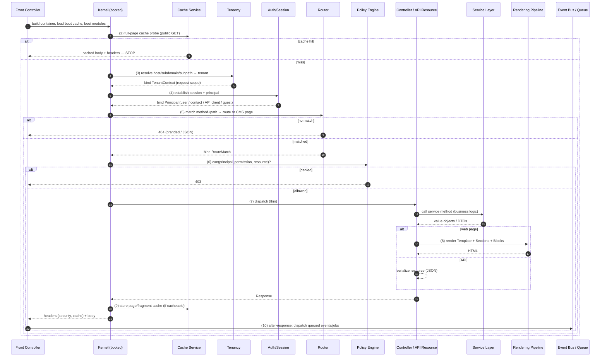

# 01 — Request Lifecycle (The Middleware Pipeline)

**Status:** Draft · **Applies to:** Slate v1.x → v5.x

Every web and API request enters through **one front controller** and flows
through **one ordered middleware pipeline**. This document expands the 10-step
summary in [01-Architecture §4](README.md#4-request--response-lifecycle-summary)
into the full contract: what each stage does, what it may short-circuit, what it
injects into the request-scoped container, and how the *same* pipeline serves
both rendered pages and serialized API resources.

This realizes *server-rendered, progressively enhanced* and *secure and
multi-tenant by default* ([00-Vision §3](../00-Vision/README.md)).

---

## 1. Why one pipeline

Today there is no single entry: `admin/*.php` files are hit directly,
`public.php`/`route.php` trampoline the public router, and `cron.php` is its own
world. Cross-cutting concerns (tenant scoping, auth, security headers, caching)
are re-implemented — or forgotten — per entry point. The audit's cross-tenant
leak surface and the "no caching layer" gap both stem from having **no shared
path** to attach these concerns to.

The pipeline makes each cross-cutting concern a **single, ordered middleware**
that every request passes through. A concern is implemented once and cannot be
skipped by accident — the structural guarantee behind
[invariants 2, 5, 6](README.md#7-architectural-invariants-must-always-hold).

---

## 2. The pipeline at a glance

A middleware is a `handle(Request, next): Response` link. The kernel composes
them into an **onion**: each wraps the next, sees the request on the way in and
the response on the way out, and may **short-circuit** (return without calling
`next`).

```php
interface Middleware
{
    public function handle(Request $req, Closure $next): Response;
}
```

| # | Stage | May short-circuit? | Injects into request scope |
|---|---|---|---|
| 1 | **Bootstrap** | on fatal error → error response | `Config`, `RequestId` |
| 2 | **Cache probe** | **yes** — full-page hit ends here | — |
| 3 | **Tenant resolve** | on unknown host → 404 | `TenantContext` |
| 4 | **Session & Auth** | on invalid credentials → 401 | `Principal` |
| 5 | **Route** | **yes** — no match → 404 | `RouteMatch` |
| 6 | **Authorize** | **yes** — deny → 403 | — |
| 7 | **Dispatch** | — (delegates to a service) | — |
| 8 | **Render** | — (pages only) | — |
| 9 | **Respond** | — (writes headers, stores cache) | — |
| 10 | **After-response** | — (runs after the client is served) | — |

The **same** stages 1–6 and 9–10 run for web and API; only **dispatch (7)** and
**render (8)** differ — a page runs the [rendering
pipeline](../05-Rendering/), an API resource serializes a value object.

---

## 3. Sequence



---

## 4. Stage contracts

### 4.1 Bootstrap
The front controller loads the PSR-4 autoloader, builds an immutable `Config`
from env, installs the global error/exception handler (errors are logged with a
`RequestId`, **never** leaked to the user — see [10-Security](../10-Security/)),
resolves the `/slate/` base path, and boots the kernel from the **boot cache**
([kernel.md §4](kernel.md)). Replaces today's per-file `require config.php`.

### 4.2 Cache probe
For safe, cacheable requests (public `GET`, no auth cookie), consult the
full-page cache **before** any tenant/auth/render work. A hit emits the stored
body + headers and **ends the request** — the cheapest possible path. Cache keys
are **tenant-scoped** (see §5) so one tenant can never serve another's page. The
cache is a swappable driver (file/APCu default; ADR-0012). Detail in
[13-Operations](../13-Operations/).

### 4.3 Tenant resolve
Map the incoming host / subdomain / subpath to a `tenant_id`, load the
`TenantContext`, and **bind it into the request-scoped container** so every
downstream service and repository is automatically scoped. An unresolvable host
is a 404, not a fallback to tenant 1. Full algorithm and storage strategies in
[multi-tenancy.md](multi-tenancy.md). This is the structural fix for today's
manual, per-query `AND tenant_id = ?`.

### 4.4 Session & Auth
Establish the session and resolve the **`Principal`** — an admin `user`, a portal
`contact`, an API client (token/key), or an anonymous guest — and bind it into
request scope. This stage is **authentication only**; it never decides access.
Login throttling / lockout lives here. (`authn ≠ authz` —
[10-Security](../10-Security/).)

### 4.5 Route
Match `method + path` against the merged **route table** the module manager
compiled into the boot cache, falling back to a CMS-page lookup
([content model](../05-Rendering/)). Produces a `RouteMatch` (handler + path
params + declared permission). No match → the router raises a 404 (branded HTML
or JSON by content negotiation). Replaces the imperative per-plugin prefix
registration in today's `PublicRouter`.

### 4.6 Authorize
The **single decision point**: the policy engine evaluates
`can(principal, permission, resource)` using the permission the route declares.
Denial short-circuits to 403. No controller re-checks permissions ad hoc; no
module runs its own authorization loop. (This retires the dead
permission-registration loop and scattered checks the roadmap flags.)

### 4.7 Dispatch (thin controller / API resource)
The handler is **thin**: it validates and maps input to a call on the [service
layer](service-layer.md), then maps the result to a response. It contains **no
business logic and no direct DB access**. Web and API handlers call the *same*
service methods — the divergence is only in what they do with the return value.

### 4.8 Render (pages only)
For HTML responses, run the one [rendering pipeline](../05-Rendering/):
Template → Sections → Blocks → Components → Tokens, skinned by the Theme Engine.
Every public-facing render goes through this single pipeline
([invariant 6](README.md#7-architectural-invariants-must-always-hold)) — no
module hand-rolls its own `<html>` document. API responses skip this stage and
serialize a value object instead.

### 4.9 Respond
Attach security headers (HSTS, CSP, frame options) and cache headers, write the
body, and — if the response is cacheable — store the page/fragment in the
tenant-scoped cache. This is the single place response headers are set.

### 4.10 After-response
Work that must not delay the client runs **after** the response is flushed:
dispatching queued domain events and enqueuing background jobs (reminder emails,
webhook deliveries, follow-ups). Events raised during dispatch are collected and
released here so listeners run off the request path — the fix for today's
synchronous email sends. Queue is a swappable driver (ADR-0012); the CLI/cron
runner drives the same job contract. See [event-system.md
§Queue-safety](event-system.md) and [13-Operations](../13-Operations/).

---

## 5. Ordering invariants (why this order)

The sequence is not arbitrary; several orderings are **security-load-bearing**:

1. **Tenant before auth before authorize.** A principal is only meaningful within
   a tenant; a permission is only meaningful for a resolved principal. Reordering
   opens cross-tenant identity confusion.
2. **Cache probe before tenant/auth work, but keyed by tenant.** The probe must be
   cheap (before expensive stages) yet never cross tenants — so the key includes
   the resolved-from-host tenant and never caches authenticated responses.
3. **Authorize before dispatch, always.** A controller is never reached for a
   request the policy engine would deny.
4. **Render is downstream of the service call.** Presentation never triggers
   business logic; it consumes value objects the service already produced.

---

## 6. Web vs API: one pipeline, two tails

| Concern | Web | API |
|---|---|---|
| Stages 1–6, 9–10 | identical | identical |
| Principal (4) | session cookie → `user`/`contact` | bearer token / key → API client |
| Route (5) | route table or CMS page | route table (versioned `/api/vN/…`) |
| Dispatch (7) | controller → service | resource → **same** service |
| Render (8) | rendering pipeline → HTML | serialize value object → JSON |
| Errors | branded error page | RFC-style JSON error + correlation id |

Because the service layer is the shared core, a capability exposed on the web is
exposed on the API for free, and both inherit tenancy, auth, and authorization
from the same middleware. Detail in [07-API](../07-API/).

---

## 7. Related documents

- [kernel.md](kernel.md) — the booted container/module manager the pipeline runs on
- [service-layer.md](service-layer.md) — what dispatch calls
- [event-system.md](event-system.md) — after-response event/job dispatch
- [multi-tenancy.md](multi-tenancy.md) — stage 3 in full
- [10-Security](../10-Security/) — auth, policy engine, error handling
- [05-Rendering](../05-Rendering/) — stage 8, the rendering pipeline
- [13-Operations](../13-Operations/) — caching, queue, deployment
