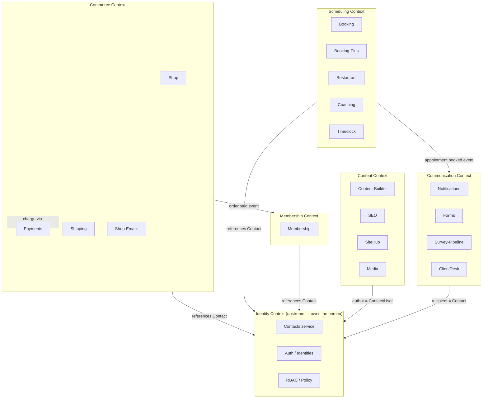

# 02 — Domain Model & Bounded Contexts

**Status:** Draft · **Applies to:** Slate v1.x → v5.x · **Anchor document**

This section defines Slate's **domain model** — the concepts the platform is
*about* (people, orders, appointments, memberships, pages, messages) — and the
boundaries that keep those concepts coherent as modules multiply. Where
[01-Architecture](../01-Architecture/) describes the *machinery* (kernel,
services, events), this section describes the *meaning* that machinery moves
around.

Read [00-Vision](../00-Vision/) and [01-Architecture](../01-Architecture/)
first. The single most important rule this section exists to enforce is
architectural invariant #4: **a person is exactly one `contacts` row; modules
attach profiles, never copies.**

---

## 1. Why this section exists (the problem it solves)

The current-state audit ([AUDIT-BRIEFING.md](../AUDIT-BRIEFING.md),
[ARCHITECTURE-ROADMAP.md](../ARCHITECTURE-ROADMAP.md) §1) found that **a single
person is modeled up to five different ways** across the platform, each in its
own table, keyed by email or phone, with no enforced foreign key:

| Table | Owner | Natural key | Verified? |
|---|---|---|---|
| `customers` | core | `(tenant_id, email)` | has `password_hash`, `email_verified`, `status` |
| `booking_customers` | booking | `(tenant_id, email)` | loose `customer_id` (nullable, no FK) |
| `shop_customers` | shop | `(tenant_id, email)` | no link to core at all |
| `restaurant_customers` | restaurant | `(tenant_id, phone)` — email nullable | no link, no unique constraint |
| `clientdesk_clients` | clientdesk | `(tenant_id, access_token)` | loose `customer_id`, plus a `company` field |

The same human who books an appointment, buys a product, reserves a table, and
becomes a coaching client is **four or five unrelated rows**. No module can
answer "what is this person's whole relationship with us?" — which is exactly
what CRM, LMS, Membership, and SaaS verticals are *built to answer*. This
fragmentation gets **exponentially harder to fix with every new module**, so it
is the first structural refactor on the roadmap (Phase 2) and the subject of
[identity-contacts.md](identity-contacts.md).

**The domain-model discipline that prevents this recurring:** name the shared
concepts once, give each an owner, and require modules to *reference* them
rather than re-implement them.

---

## 2. The core principle: shared concepts in core, specifics in profiles

> **A shared domain concept lives in exactly one core service. Module-specific
> data about that concept lives in a module profile keyed by the core record's
> id — never in a duplicate of the core record.**

This is the domain-layer expression of the platform's "one concept, one owner"
philosophy ([00-Vision](../00-Vision/) §2). It splits every entity into two
kinds of data:

- **Shared identity/attributes** — who the person *is* (name, email, phone),
  what a product *costs* (`Money`), which file an image *is* (`media_files`).
  These belong to a **core service** and are the same fact everywhere.
- **Module-specific facts** — a booking customer's `no_show_count` and
  `loyalty_points`, a shop customer's shipping address, a clientdesk client's
  `source` and lead `status`. These are **profiles**: satellite rows that a
  module owns, each pointing at the shared record by id.

| | Shared concept (core service owns) | Module profile (module owns) |
|---|---|---|
| **Person** | `contacts` row: name, email, phone, org-vs-person | `booking_profile` (loyalty, no-shows), `shop_profile` (addresses), `crm_lead` (source, stage) |
| **Money** | `Money` value object (integer minor units) | line-item quantities, discount rules, tax logic |
| **Media** | `media_files` (already core) | usage records, alt-text overrides, crop presets |

The test for "is this a shared concept?" is: *would two modules disagree about
the answer if they each stored it?* A person's email is one fact — two modules
storing it will drift. A booking's no-show count is booking's business alone.
The first goes in core; the second stays in the module.

**Why this matters for module integration:** a module never has to *import*
another module's data. Booking doesn't ask shop for an address; it asks the
**Contacts service** for the person, and shop's address is shop's own profile.
Every module reaches the shared concept through a contract
([01-Architecture](../01-Architecture/) §5), so the concept can be re-stored,
migrated, or scaled without any module noticing.

---

## 3. Bounded contexts

A **bounded context** is a region of the domain with its own consistent
vocabulary and its own service ownership. Contexts are *conceptual* — they group
related modules and the core services those modules lean on. They are **not** a
new runtime boundary: the runtime boundaries are still Kernel / Service / Module
([01-Architecture](../01-Architecture/) §2). Contexts tell you *which service a
concept belongs to* and *which modules speak the same language*.

Slate has six bounded contexts. **Identity is upstream of all the others** —
every context refers to a Contact but none of them own the person record.

### 3.1 Identity Context — *who*
Owns the **person and organization** record, authentication linkage, and
authorization. This is the platform's spine. Detailed in
[identity-contacts.md](identity-contacts.md).
- **Core services:** Contacts, Auth/Identities, RBAC/Policy.
- **Core tables (target):** `contacts`, `identities`, `contact_tags`,
  `contact_relationships`; `users`, `roles`, `role_permissions`.
- **Ubiquitous language:** Contact, Identity, Profile, Tag, guest vs registered,
  merge, portal login.

### 3.2 Commerce Context — *value exchanged*
Selling physical/digital goods and moving money.
- **Modules:** `shop`, `stripe-payment`, `shipping-flat-rate` /
  `flat-rate-shipping`, `shop-emails`. **Core service:** Payments
  (`PaymentGateway` contract — [07-API](../07-API/)).
- **Ubiquitous language:** Product, Cart, Order, Line item, `Money`, Coupon,
  Shipping rate, Refund.
- **Depends on:** Identity (buyer is a Contact), `Money` value object
  ([11-Database](../11-Database/)).

### 3.3 Scheduling Context — *time and capacity*
Anything that reserves a slot of time or a resource against a calendar.
- **Modules:** `booking`, `booking-plus`, `restaurant` (reservations),
  `coaching` (sessions), `timeclock` (staff hours).
- **Ubiquitous language:** Service, Provider, Slot, Appointment, Reservation,
  Capacity, Recurrence, Availability, No-show.
- **Depends on:** Identity (attendee/client is a Contact), Commerce (deposits
  via `PaymentGateway`), Communication (reminders).

### 3.4 Membership Context — *ongoing relationship*
Recurring/fixed-term entitlements layered on a person.
- **Modules:** `membership` (via the `MembershipAPI` facade).
- **Ubiquitous language:** Plan, Term, Phase, Entitlement, Renewal, Billing
  cycle.
- **Depends on:** Identity (member is a Contact), Commerce (billing), Scheduling
  (member benefits on booking) — integrates via events, not class calls.

### 3.5 Content Context — *what the site says*
The public site, pages, media, and how they are found.
- **Modules:** `content-builder`, `seo`, `sitehub`. **Core services:** Media,
  the Rendering stack ([05-Rendering](../05-Rendering/)).
- **Ubiquitous language:** Post type, Block, Section, Template, Page, Menu,
  Taxonomy, Meta, Sitemap.
- **Depends on:** Identity only for *authorship/ownership* (author is a User or
  Contact); otherwise self-contained.

### 3.6 Communication Context — *reaching people*
Outbound and inbound messaging, forms, and client-facing collaboration.
- **Modules:** `forms`, `survey-pipeline`, `clientdesk`. **Core services:**
  Notifications, Mailer.
- **Ubiquitous language:** Message, Channel, Template, Submission, Notification,
  Thread.
- **Depends on:** Identity (recipient/submitter is a Contact — a form submission
  should *find or create* a Contact, not spawn a sixth person table).

---

## 4. How modules map to contexts

A module lives *primarily* in one context but may **participate** in others by
consuming their contracts and events. That is expected and healthy — it is the
difference between a context (conceptual grouping) and a module (deployable
unit). What is **not** allowed is a module *owning a concept another context
owns*. Booking may read a Contact; it may not store its own person record.

| Module | Primary context | Also participates in (via contract/event) |
|---|---|---|
| `booking`, `booking-plus` | Scheduling | Identity (Contact), Commerce (deposit), Communication (reminders) |
| `restaurant` | Scheduling | Identity (Contact), Communication |
| `coaching` | Scheduling | Identity (Contact), Communication, Content (program pages) |
| `timeclock` | Scheduling | Identity (staff = User) |
| `shop`, `shipping-*`, `shop-emails` | Commerce | Identity (Contact), Communication |
| `stripe-payment` | Commerce | provides the `PaymentGateway` capability |
| `membership` | Membership | Identity, Commerce, Scheduling (all via events) |
| `content-builder`, `sitehub`, `seo` | Content | Identity (author), Media |
| `forms`, `survey-pipeline` | Communication | Identity (submitter → Contact) |
| `clientdesk` | Communication | Identity (client = Contact + org), Content (deliverables) |
| `small-business-kit` | (cross-cutting kit) | hooks only; owns no concept |

**Reading this table as an integration guide:** the "also participates in"
column is a list of *contracts and events the module wires to*, never a list of
tables it reads. When `membership` needs to know a member booked an
appointment, it subscribes to `appointment.booked`; it does not query
`booking_appointments`. This is invariant #1 ("no module references another
module's class or table") expressed at the domain level.

---

## 5. Context relationships (the context map)

Contexts relate in one of three ways. Naming the relationship tells a module
author *which integration channel to use*.

| Upstream (owns) | Downstream (depends) | Relationship | Channel |
|---|---|---|---|
| Identity | every other context | **Shared kernel** — the Contact is one shared record all contexts reference | Contacts service contract |
| Commerce (Payments) | Scheduling, Membership | **Customer/Supplier** — downstream needs charges | `PaymentGateway` contract |
| Commerce, Scheduling | Communication, Membership | **Published events** — facts others react to | `order.paid`, `appointment.booked` |
| Content (Media) | all | **Shared kernel** — one media library | Media service contract |

Two anti-patterns the map forbids, both seen in today's code:

1. **Conformist copying** — a downstream context copying an upstream record
   into its own table (the five person tables). Replaced by *referencing* the
   upstream record by id.
2. **Shared database** — two contexts reading/writing the same tables directly.
   Today this is avoided only by convention (each plugin uses its own prefix and
   integrates via `*API`), with nothing enforcing it. Replaced by **each context
   owning its tables** with *enforced* ownership, integrating through
   contracts/events ([01-Architecture](../01-Architecture/) §5).

---

## 6. Domain concepts and their canonical owners

The lookup table for "who owns this concept." If a module needs one of these,
it consumes the owner's contract — it does not re-create the concept.

| Concept | Canonical owner | Where documented |
|---|---|---|
| Person / Organization (**Contact**) | Contacts service (`contacts`) | [identity-contacts.md](identity-contacts.md) |
| Login / auth linkage (**Identity**) | Auth service (`identities`) | [identity-contacts.md](identity-contacts.md), [10-Security](../10-Security/) |
| Permissions (**Role/Policy**) | RBAC service | [10-Security](../10-Security/) |
| **Money** | `Money` value object | [11-Database](../11-Database/), ADR-0011 |
| **Tenant** | Tenancy service | [01-Architecture/multi-tenancy.md](../01-Architecture/multi-tenancy.md) |
| **Media** file | Media service (`media_files`) | [core media library] (already promoted to core) |
| Page / Block / Section | Content services + Block Registry | [05-Rendering](../05-Rendering/), ADR-0007 |
| Payment / Charge | Payments (`PaymentGateway`) | [07-API](../07-API/) |
| Notification / Message | Notifications service | [08-Modules](../08-Modules/) |
| **Tag** (cross-module) | Contacts service (`contact_tags`) | [identity-contacts.md](identity-contacts.md) |

---

## 7. Documents in this section

- **[identity-contacts.md](identity-contacts.md)** — the Identity & Contacts
  architecture in depth (per ADR-0006): the `contacts` / `identities` /
  profile model, dedup & merge, tagging, search, org↔person relationships,
  guest vs registered, portal login, GDPR export/delete, the migration from
  today's five tables, the ERD, and the `IdentityStore` / `ContactRepository`
  contracts.

Future documents may add per-context domain deep-dives (Commerce order model,
Scheduling availability model) as those contexts formalize; each will follow the
same "shared concept in core, specifics in profiles" discipline defined here.

---

## 8. Cross-references

- **[01-Architecture](../01-Architecture/)** — the runtime layers and the three
  inter-module channels these contexts communicate over; invariant #4.
- **[08-Modules](../08-Modules/)** — per-module specifications; each module names
  its primary context and the contracts it consumes.
- **[11-Database](../11-Database/)** — schema conventions, the migration
  framework these consolidations ride on, and the `Money` value object.
- **[14-ADR](../14-ADR/)** — ADR-0006 (Unified Identity/Contacts), ADR-0011
  (`Money`), ADR-0005 (events + contracts for inter-module communication).
- **[09-Roadmap](../09-Roadmap/)** — Phase 2 (identity unification) sequences the
  work this section specifies.
