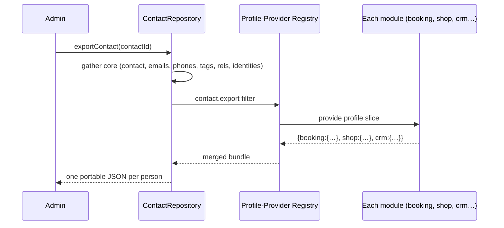

# 02 — Identity & Contacts

**Status:** Draft · **Applies to:** Slate v1.x → v5.x · **Realizes ADR-0006**

This is the depth document behind the domain model's most load-bearing rule:
**architectural invariant #4 — a person is exactly one `contacts` row; modules
attach profiles, never copies** ([01-Architecture](../01-Architecture/) §7). It
specifies the target Identity Context: one `contacts` table (person *or*
organization), an `identities` auth-linkage layer, and module **profiles** keyed
by `contact_id`. **One identity, many profiles.**

Read the [section README](README.md) first — it establishes *why* this exists
(the five parallel person tables) and the "shared concept in core, specifics in
profiles" discipline. This document says *how* the model is shaped, queried,
merged, exported, and migrated to.

---

## 1. WHAT we are building (the model in one paragraph)

A **Contact** is the single canonical record of a real-world party — a **person**
or an **organization** — scoped to a tenant. A Contact carries only facts that
are true everywhere: name, one or more emails/phones, kind, lifecycle status. An
**Identity** is an *authentication linkage*: the credential(s) by which a Contact
can log in to the customer portal (password, and later OAuth/passkey). A Contact
with no Identity is a **guest**; attach an Identity and it becomes **registered**
— the same row, promoted, never re-created. Everything a module needs to know
*about* a Contact that is the module's own business lives in a **profile**: a
satellite table the module owns, keyed by `contact_id`. Contacts relate to each
other through `contact_relationships` (person ↔ org, org ↔ org). The whole thing
is reachable only through two contracts — `ContactRepository` (the party) and
`IdentityStore` (the login) — so no module ever touches the tables directly.

```
                 ┌─────────────────────────────────────────┐
   guest ───────▶│   contacts   (person OR organization)   │◀─────── registered
                 │   the ONE canonical party record         │
                 └───────────────┬──────────────────────────┘
                                 │ contact_id (the only join key)
     ┌───────────────┬───────────┼────────────┬────────────────┐
     ▼               ▼           ▼            ▼                ▼
 identities     booking_      shop_        crm_lead        contact_tags /
 (portal auth)  profile       profile      (CRM)           relationships
```

---

## 2. WHY (what the current model costs, and the target property)

The [section README](README.md) §1 and [AUDIT-BRIEFING](../AUDIT-BRIEFING.md) §9
document today's fragmentation: **one human is up to five unrelated rows** —
`customers`, `booking_customers`, `shop_customers`, `restaurant_customers`,
`clientdesk_clients` — email- or phone-keyed, with no enforced foreign key.

| Cost today | Caused by | Fixed by |
|---|---|---|
| No "whole relationship" view | five email-keyed tables, no FK | one `contacts` row, profiles join by id |
| Silent drift (name/email differ per module) | each module stores its own copy | modules store *only* their own facts |
| Dedup is per-module or absent | no shared match logic | one `ContactRepository::resolveOrCreate()` |
| GDPR export/delete misses tables | no registry of where a person lives | profile-provider registry + erasure coordinator |
| Every new module makes it worse | copying is the path of least resistance | referencing is the *only* path offered |

**The single target property:** *given one `contact_id`, the platform can name
every profile, tag, relationship, login, and message that concerns that person —
and can merge, export, or erase them as a unit.* That property is impossible with
five disjoint tables and trivial with one canonical row.

This unification is **ADR-0006** and roadmap **Phase 2**
([09-Roadmap](../09-Roadmap/)). It is sequenced early precisely because the audit
notes the cost grows *exponentially* with each module added.

---

## 3. HOW — the schema shape

### 3.1 ERD (target)

```mermaid
erDiagram
    tenants ||--o{ contacts : scopes
    contacts ||--o{ contact_emails : "has"
    contacts ||--o{ contact_phones : "has"
    contacts ||--o| identities : "may log in via"
    contacts ||--o{ contact_tag_map : "tagged by"
    contact_tags ||--o{ contact_tag_map : "applied via"
    contacts ||--o{ contact_relationships : "from"
    contacts ||--o{ contact_relationships : "to"
    contacts ||--o{ contact_merges : "survivor/loser"
    contacts ||--o| booking_profile : "module profile"
    contacts ||--o| shop_profile : "module profile"
    contacts ||--o| crm_lead : "module profile"

    contacts {
        bigint id PK
        int tenant_id FK
        enum kind "person | organization"
        string display_name
        string primary_email "denormalized, from contact_emails"
        string primary_phone
        enum status "active | archived | merged"
        bigint merged_into_id FK "null unless status=merged"
        json meta
        datetime created_at
        datetime updated_at
    }
    contact_emails {
        bigint id PK
        bigint contact_id FK
        int tenant_id
        string email "normalized: lower, trimmed"
        bool is_primary
        bool verified
        UNIQUE tenant_email "(tenant_id, email)"
    }
    contact_phones {
        bigint id PK
        bigint contact_id FK
        string phone "E.164 normalized"
        bool is_primary
    }
    identities {
        bigint id PK
        bigint contact_id FK "the party this login IS"
        int tenant_id
        enum provider "password | google | passkey"
        string credential_ref "email for password; subject for OAuth"
        string password_hash "bcrypt; null for OAuth"
        bool email_verified "soft flag, NOT an auth gate"
        enum status "active | suspended"
        datetime last_login_at
        UNIQUE tenant_provider_cred "(tenant_id, provider, credential_ref)"
    }
    contact_tags {
        bigint id PK
        int tenant_id
        string slug "unique per tenant"
        string label
        string color
    }
    contact_tag_map {
        bigint contact_id FK
        bigint tag_id FK
        bigint applied_by "user id"
        datetime applied_at
    }
    contact_relationships {
        bigint id PK
        int tenant_id
        bigint from_contact_id FK
        bigint to_contact_id FK
        enum type "employee_of | member_of | parent_org | household | primary_contact"
        json meta "e.g. role/title"
    }
    contact_merges {
        bigint id PK
        int tenant_id
        bigint survivor_id FK
        bigint loser_id FK
        json snapshot "loser row + profile pointers, for undo/audit"
        bigint merged_by
        datetime merged_at
    }
    booking_profile {
        bigint contact_id PK "FK to contacts"
        int no_show_count
        int loyalty_points
    }
    shop_profile {
        bigint contact_id PK "FK to contacts"
        json addresses
        string default_currency
    }
    crm_lead {
        bigint contact_id PK "FK to contacts"
        string source
        enum stage "new | qualified | won | lost"
        bigint owner_user_id
    }
```



### 3.2 The three core tables (and why each exists)

| Table | Owns | Why separate from the others |
|---|---|---|
| `contacts` | the party (person/org), name, status, kind | a party exists whether or not it can log in or buys anything |
| `identities` | login credential(s), portal auth state | one person may have several logins (password + Google); many contacts (orgs, guests) have none |
| `*_profile` (per module) | module-specific facts about a contact | invariant #1 — a module owns its tables; these are *its* facts, joined by `contact_id` |

`contact_emails` / `contact_phones` are child tables, not columns, because dedup
and merge require a person to hold **several** verified addresses (the exact thing
five separate tables kept fragmenting). `contacts.primary_email` is a denormalized
convenience column kept in sync with the primary child row — never the source of
truth for uniqueness.

**Person vs organization** is `contacts.kind`, not two tables. An org is a Contact
with `kind='organization'`; its people are Contacts linked by
`contact_relationships(type='employee_of')`. This is why `clientdesk`'s bespoke
`company` field disappears — a company is a first-class Contact, not a string on a
client row.

---

## 4. Guest vs registered, and portal login

The distinction is **presence of an Identity**, nothing else:

| State | `contacts` row | `identities` row | Can log in? | Created by |
|---|---|---|---|---|
| **Guest** | yes | no | no | checkout, booking, form submission (`resolveOrCreate`) |
| **Registered** | yes (same row) | yes | yes | portal register, or guest promotion |

**Promotion is additive.** A guest who booked last month and now registers keeps
the *same* `contact_id`; registration inserts an `identities` row and links it —
the booking profile, tags, and history come along for free because they were never
keyed to the login. This is the concrete payoff of separating identity (party)
from Identity (login).

`identities` **replaces today's `customers`/`customer_auth_tokens` auth surface.**
Portal login resolves an Identity by `(tenant_id, provider, credential_ref)`,
verifies the credential, and loads the linked Contact. Two rules carry forward
from the audit unchanged:

- **`email_verified` is a soft flag, not an authorization gate**
  ([AUDIT-BRIEFING](../AUDIT-BRIEFING.md) §8) — it lives on `identities` and gates
  UX nudges only. Authorization is the policy engine's job ([10-Security](../10-Security/)).
- **Admin/staff logins stay in `users`.** `users` is *operators of the install*;
  `identities` is *portal end-users tied to a Contact*. They are different
  populations with different lifecycles and are intentionally not merged. RBAC and
  the policy engine live in [10-Security](../10-Security/).

Per-IP throttling, single-use hashed tokens, bcrypt auto-rehash, and the
enumeration-timing defenses described in [AUDIT-BRIEFING](../AUDIT-BRIEFING.md) §5
move behind `IdentityStore` intact.

---

## 5. Dedup & merge

Two moments matter: **stopping duplicates at creation**, and **healing the ones
that already exist**.

### 5.1 Prevention — `resolveOrCreate`

Every module that today would `INSERT` a person instead calls one method. It
matches on normalized identifiers before creating:

1. Normalize the email (lower/trim) and phone (E.164).
2. Look up `contact_emails` / `contact_phones` for a hit within the tenant.
3. On hit → return the existing Contact (attach/refresh the module's profile).
4. On miss → create one Contact, one email/phone child, return it.

This is the single choke point that makes a sixth person table impossible: a form
submission or guest checkout *finds or creates*, it never spawns.

### 5.2 Healing — `merge(survivor, loser)`

Merge is a first-class, audited operation, not a manual SQL job:

- **Re-point** every FK from `loser_id` to `survivor_id`: emails, phones,
  identities, tags, relationships, **and every module profile**. Modules do not
  hard-code the list — each profile owner registers via the `contact.merge`
  extension point, so `merge()` fans out to them (a profile with a uniqueness rule
  decides how to reconcile, e.g. sum `no_show_count`, keep the higher
  `loyalty_points`).
- **Mark** the loser `status='merged'`, set `merged_into_id = survivor`. The row
  is *tombstoned, not deleted*, so stale references (cached ids, external links)
  resolve forward.
- **Record** a `contact_merges` snapshot for audit and best-effort undo.

Candidate detection (fuzzy name + shared email/phone) surfaces suggestions in the
admin; a human confirms. Automatic merges are limited to exact verified-email
matches.

---

## 6. Tagging & search

**Tagging** is a *core* concept (per the [README](README.md) §6 owner table), not a
per-module one, because a segment like "VIP" or "newsletter" must span booking,
shop, and CRM. `contact_tags` is the tenant-scoped registry; `contact_tag_map` is
the many-to-many. Modules and admins apply/read tags through `ContactRepository`;
tags drive segmentation, exports, and Communication-context sends.

**Search** is a first-class `ContactRepository` capability answering "find the
person" across all identifiers at once:

- Matches across `display_name`, every `contact_emails`, every `contact_phones`,
  and (optionally) profile fields exposed by modules.
- Filters by `kind`, `status`, tag, relationship (e.g. "people at org X"),
  and profile predicates ("has a booking profile").
- Backed by the platform Search service ([01-Architecture](../01-Architecture/) §2)
  where available; degrades to indexed `LIKE` on shared hosting (swappable driver,
  ADR-0012). Tenant scope is always applied by the base repository (invariant #2).

Because search reads the *canonical* row, "one person, one result" holds — the
fragmentation that made cross-module lookup impossible is gone by construction.

---

## 7. Organization ↔ person relationships

`contact_relationships` is a typed, directional edge between two Contacts:

| `type` | from → to | Example |
|---|---|---|
| `employee_of` | person → org | staff member at a client company |
| `member_of` | person → org | member of a household or association |
| `parent_org` | org → org | subsidiary → parent |
| `primary_contact` | person → org | the billing/day-to-day contact for an org |
| `household` | person → person | family sharing an address |

This lets the CRM/ClientDesk contexts answer "who works at Acme?" and "what is
Acme's whole footprint?" without any module inventing a `company` string. An org's
orders, appointments, and messages are the union over its related people plus the
org's own profiles — computed at read time from one edge table, never duplicated.

---

## 8. GDPR — export & delete across every profile

Because a person is scattered across module profiles by design, export and erasure
**must be coordinated**, not table-local. The mechanism is a **profile-provider
registry**: every module that keeps a profile registers a small provider declaring
how to export and how to erase its slice, and core fans a request out to all of
them.



- **Export** (`contact.export`) — core assembles the canonical row + emails,
  phones, tags, relationships, and non-secret identity metadata; each provider
  appends its profile. Result is one portable document per person (Right to
  Access / Portability).
- **Erase** (`contact.erase`) — core resolves the Contact (following any
  `merged_into` chain), invokes each provider to delete or pseudonymize its
  profile, revokes identities, then tombstones or hard-deletes the core row per
  policy. Records that must survive for legal/accounting reasons (paid orders) are
  **pseudonymized** — the `contact_id` link severed, not the financial record
  destroyed — with the decision logged in `audit_log`.
- **Auditability** — both operations write to `audit_log`
  ([AUDIT-BRIEFING](../AUDIT-BRIEFING.md) §4) with actor, subject, and scope.

A module that fails to register a provider is a **compliance bug caught in
review**: the registry is the enforcement point that makes "where does this person
live?" answerable, which was impossible across five disjoint tables.

---

## 9. Contracts (interface sketches)

Two contracts are the *only* way any module touches this domain. Signatures are
illustrative (PHP 8.1+, flat-PHP house style); the authoritative surface is the
SDK ([06-SDK](../06-SDK/)) under the BC policy ([03-Standards](../03-Standards/)).

### 9.1 `ContactRepository` — the party

```php
interface ContactRepository
{
    // ---- read ----
    public function find(int $contactId): ?Contact;              // follows merged_into
    public function findByEmail(string $email): ?Contact;
    public function findByPhone(string $phone): ?Contact;
    public function search(ContactQuery $q): ContactPage;        // §6: name+email+phone+tags+profiles

    // ---- write ----
    public function create(ContactDraft $draft): Contact;        // person OR org (kind)
    public function update(int $contactId, ContactPatch $p): Contact;

    /** §5.1 the single choke point that kills duplicate person tables. */
    public function resolveOrCreate(ContactMatch $m): Contact;   // find by email/phone, else create

    // ---- dedup / merge (§5.2) ----
    public function findDuplicates(int $contactId): array;       // suggestion list
    public function merge(int $survivorId, int $loserId): Contact; // fans out via contact.merge

    // ---- tags (§6) ----
    public function tag(int $contactId, string $tagSlug): void;
    public function untag(int $contactId, string $tagSlug): void;
    public function withTag(string $tagSlug, ?ContactQuery $q = null): ContactPage;

    // ---- relationships (§7) ----
    public function relate(int $fromId, int $toId, string $type, array $meta = []): void;
    public function relationsOf(int $contactId, ?string $type = null): array;

    // ---- GDPR (§8) — core assembles, providers append via extension points ----
    public function exportContact(int $contactId): array;        // contact.export
    public function eraseContact(int $contactId, ErasurePolicy $policy): void; // contact.erase
}
```

### 9.2 `IdentityStore` — the login

```php
interface IdentityStore
{
    // resolve a login → the Contact behind it (§4)
    public function findByCredential(string $provider, string $credentialRef): ?Identity;
    public function contactFor(int $identityId): Contact;

    // registration & guest promotion — same contact_id, additive (§4)
    public function register(int $contactId, Credential $c): Identity;
    public function promoteGuest(int $contactId, Credential $c): Identity;

    // authentication (throttling, timing-safe verify, bcrypt rehash live here)
    public function attemptLogin(string $provider, string $credentialRef, string $secret): ?Session;
    public function issueToken(int $identityId, string $purpose): string;   // verify / reset, single-use hashed
    public function consumeToken(string $rawToken, string $purpose): ?Identity;

    // state — email_verified is a soft flag, never an authz gate (§4)
    public function markEmailVerified(int $identityId): void;
    public function suspend(int $identityId): void;
    public function linkOAuth(int $contactId, OAuthGrant $g): Identity;      // second login on one contact
}
```

**Interplay:** a module never resolves a person by login. It calls
`ContactRepository` for the party and, only inside the portal auth flow, uses
`IdentityStore` to authenticate and hand back a Contact. Profiles are then loaded
by the owning module keyed on `contact_id` — the join key that never changes.

---

## 10. Consolidation & migration strategy (from today's five tables)

The migration runs on the versioned framework (ADR-0010, [11-Database](../11-Database/)),
**not** the `ensureSchema()` self-heal. It is designed to be reversible per step
and to keep the five legacy tables working until every reader is cut over —
backward compatibility is non-negotiable ([03-Standards](../03-Standards/)).

**Phase 2 sequence** ([09-Roadmap](../09-Roadmap/)):

| Step | Action | Safety property |
|---|---|---|
| 1. **Create** | Add `contacts`, `contact_emails/phones`, `identities`, `contact_tags`, `contact_tag_map`, `contact_relationships`, `contact_merges`. | Additive; no existing reader touched. |
| 2. **Seed** | Backfill from `customers` first (it has the richest auth data → becomes the initial `contacts` + `identities`). | `customers` remains the source; new tables are a copy to validate against. |
| 3. **Match & fold** | Walk `booking_customers`, `shop_customers`, `restaurant_customers`, `clientdesk_clients`; for each, `resolveOrCreate` against the seeded set (email, then phone). Matches attach; misses create a Contact. | Idempotent; a dry-run reports the merge/create counts before writing. |
| 4. **Profilize** | Convert each legacy row's *module-specific* columns into `booking_profile` / `shop_profile` / `crm_lead` keyed by the resolved `contact_id`. `clientdesk`'s `company` becomes an org Contact + `employee_of` edge. | Legacy tables keep their person columns; profiles are the new home, dual-written. |
| 5. **Repoint readers** | Add a nullable `contact_id` FK to each legacy table (booking already has a loose one); switch module reads to go through `ContactRepository`; **dual-write** during the window. | Either path resolves the same person; rollback = stop reading the new path. |
| 6. **Verify** | Reconcile counts, spot-check merges, confirm GDPR export/erase spans all profiles. | Gate before any drop. |
| 7. **Retire** | Once all readers use the contract, demote legacy person tables to read-only, then drop in a later release. | **Requires explicit sign-off — there is no VCS in the tree** ([AUDIT-BRIEFING](../AUDIT-BRIEFING.md) §9); dropping is irreversible. |

**Match precedence** for step 3: verified email > unverified email > E.164 phone.
Ambiguous multi-hit rows are *not* auto-merged — they land in the admin
duplicate-review queue (§5.2). The restaurant table (phone-primary, email
nullable) is why phone is a first-class match key, not an afterthought.

**Backward-compat shim:** for one major version, a thin compatibility layer lets
legacy code that still expects a `booking_customers` row read through a view over
`contacts` + `booking_profile`, mirroring how `media-library` became a required
shim after Media went core ([AUDIT-BRIEFING](../AUDIT-BRIEFING.md) §6).

---

## 11. Cross-references

- **[README.md](README.md)** — the Identity Context, the five-table problem, and
  the "shared concept in core, specifics in profiles" discipline this realizes.
- **[01-Architecture](../01-Architecture/)** — invariant #4 (one `contacts` row),
  invariant #1 (module owns its tables), the three inter-module channels the
  `contact.*` extension points use.
- **[08-Modules](../08-Modules/)** — each module spec names the profile it owns and
  the `ContactRepository` / `IdentityStore` contracts it consumes.
- **[11-Database](../11-Database/)** — schema conventions, tenant auto-scoping, the
  migration framework §10 rides on (ADR-0010), and the swappable-driver policy
  (ADR-0012) behind search.
- **[10-Security](../10-Security/)** — portal auth, policy engine (authorization ≠
  `email_verified`), the `users` vs `identities` split.
- **[14-ADR](../14-ADR/)** — **ADR-0006** (Unified Identity/Contacts), ADR-0010
  (migration framework), ADR-0012 (swappable drivers).
- **[09-Roadmap](../09-Roadmap/)** — Phase 2 sequences the §10 consolidation.
