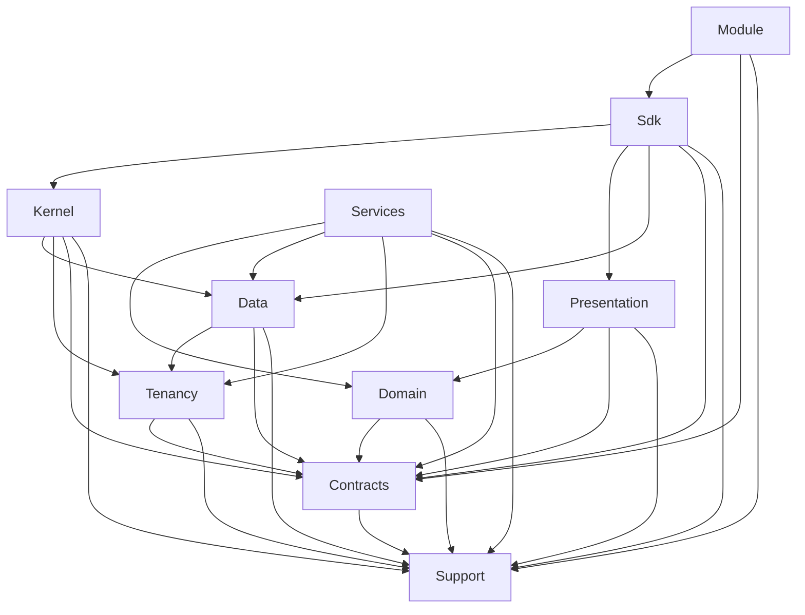
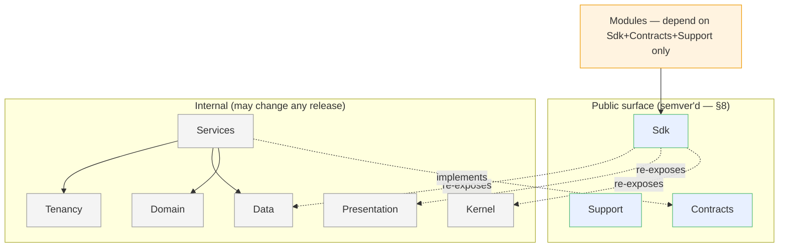

# 03 — Core Platform Foundation Standard

**Status:** **Accepted / Frozen — Platform Foundation v1.0** (2026-07-27) ·
**Applies to:** Slate v1.x → v5.x · **Canonical foundational reference**

This is the single authoritative description of how Slate is structured at the
code level: its namespaces, its `src/` layout and layer ownership, the dependency
rules between layers, autoloading, coding and DI/container conventions, the
public/SDK boundary, and the backward-compatibility strategy. It is written so
that **a contributor five or ten years from now can understand the entire platform
structure by reading this one document before opening a single source file.**

It is a *decide-once* standard. The rationale and rejected alternatives are in
[ADR-0013](../14-ADR/0013-namespace-strategy-and-src-layout.md). It aligns with and
does not restate the layer *responsibilities* in
[01-Architecture](../01-Architecture/README.md), the *rendering* stack in
[05-Rendering](../05-Rendering/), the *SDK* surface in [06-SDK](../06-SDK/), and the
*data* rules in [11-Database](../11-Database/) — it is the structural spine those
sit on. Vocabulary is the [canonical glossary](../README.md#canonical-glossary-fixed-vocabulary),
used exactly.

> **RFC-2119.** MUST / MUST NOT are hard rules (enforced in review and, over time,
> by [conformance checks](../12-Testing/architecture-conformance.md)). SHOULD is a
> strong default waivable with a written reason. MAY is a genuine option.

> **Backward compatibility is absolute.** Everything here is introduced additively.
> Existing plugins and the live site keep working **without modification** via
> `class_alias` shims (§10). Nothing is renamed or removed until its replacement is
> proven at parity.

---

## 0. How to read this document

- **New contributor:** read §1–§3 (the map, the tree, the rules) — that is the
  whole platform in three sections. Then §5–§9 before writing code.
- **Writing a module:** §9 (SDK boundary) + §11.2 + [module-development-standards.md](module-development-standards.md).
- **Adding a core service:** §7 + §11.1.
- **Reviewer:** §3 (dependency rules) + §8 (public/internal) are the checklist.

---

## 1. Namespace hierarchy & naming conventions

**Vendor root:** `Slate\` → **`src/`** (PSR-4). Ten top-level namespaces, each a
layer of the [Architecture Blueprint](../01-Architecture/README.md). We use
`Slate\Kernel`, never a vague `Slate\Core`, so there is no catch-all bucket.

| # | Namespace | Layer / role | Stability |
|---|---|---|---|
| 1 | `Slate\Support\` | Domain-neutral utilities & value objects | public |
| 2 | `Slate\Contracts\` | Capability **interfaces** (the covered surface) | public |
| 3 | `Slate\Data\` | Persistence primitives | internal |
| 4 | `Slate\Tenancy\` | Multi-tenancy context, resolver, drivers | internal |
| 5 | `Slate\Domain\` | Shared core domain **models** | mixed (models public, internals not) |
| 6 | `Slate\Kernel\` | Domain-agnostic plumbing (container, modules, events, http) | internal |
| 7 | `Slate\Services\` | Platform service **implementations** | internal |
| 8 | `Slate\Presentation\` | The render stack | mixed |
| 9 | `Slate\Sdk\` | Stable module-facing base classes | public |
| 10 | `Slate\Module\` | First-party & third-party modules | per-module |

### Naming conventions (MUST)

- Namespace segments and class names are `PascalCase`; one class per file, file
  named exactly `ClassName.php` (PSR-4).
- **Interfaces named by role, no `I` prefix:** `PaymentGateway`, not
  `IPaymentGateway`. Concrete implementations are named concretely: `StripeGateway`.
- **Value objects** are nouns: `Money`, `EmailAddress`. **Services** are nouns
  ending in their role: `IdentityStore`, `EventBus`. **Base classes** module authors
  extend are unqualified nouns: `Sdk\Module`, `Sdk\Service`, `Sdk\Block`.
- **Events** are past-tense payload classes: `OrderPaid`, `ContactCreated`. **Event
  names** (string keys) are `<domain>.<verb>`: `order.paid`. **Extension points** are
  `<area>.<noun>`: `seo.meta`.
- **Exceptions** live under the owning namespace, suffixed `Exception`
  (`Slate\Data\Exception\ConnectionException`).
- **Two disambiguating rules** (memorize these):
  - **Domain = nouns/models; Services = verbs/orchestration.** `Domain\Identity\Contact`
    is the model; `Services\Identity\IdentityStore` operates on it.
  - **Contracts = interfaces; Services = implementations.** `Contracts\Payments\PaymentGateway`
    is the interface; `Services\Payments\StripeGateway` implements it.

---

## 2. `src/` directory architecture & layer ownership

The tree mirrors §1 exactly and is created **in full up front** so the shape is
fixed even where files land later. Each top-level directory has one owning concern.

```
src/
├── Support/               ← utilities & value objects (no dependencies)
│   Money.php  Result.php  Collection.php  Clock.php  Uuid.php  Html.php  Str.php  Arr.php
├── Contracts/             ← capability interfaces only (no logic)
│   Payments/  Identity/  Media/  Notifications/  Search/
│   Shipping/  Rendering/  Seo/   Cache/          Queue/  Data/  Events/
├── Data/                  ← persistence primitives
│   Database.php  QueryBuilder.php  Repository.php  Entity.php
│   Migration.php  MigrationRunner.php  Schema/ (Schema, Table, Column)  Exception/
├── Tenancy/               ← multi-tenant context & storage strategy
│   TenantContext.php  TenantResolver.php  Driver/ (SharedDatabase, SchemaPerTenant, DatabasePerTenant)
├── Domain/                ← shared core domain models
│   Identity/ (Contact, Organization, Identity, ContactProfile, EmailAddress, PhoneNumber)
├── Kernel/                ← domain-agnostic plumbing
│   Bootstrap.php  Config.php
│   Container/ (Container, Definition, ServiceProvider)
│   Module/  (ModuleManager, DependencyResolver, ModuleManifest, PluginLoader)
│   Event/   (EventBus, Event, Hook, Listener)
│   Http/    (FrontController, Request, Response, Router, Middleware, Pipeline, PublicRouter)
├── Services/              ← platform service implementations (one subdir each)
│   Auth/ Rbac/ Identity/ Payments/ Media/ Seo/ Notifications/
│   Assets/ Search/ Settings/ Audit/ I18n/ Cache/ Queue/
├── Presentation/          ← the render stack
│   Tokens/ Components/ Blocks/ (BlockRegistry, Block, Renderer)
│   Sections/ Templates/ Theme/ Rendering/ (RenderPipeline, RenderContext) PageBuilder/
├── Sdk/                   ← the stable, module-facing surface
│   Module.php  Service.php  Repository.php  Block.php  Component.php
│   Http/ (Controller)  Testing/
├── Module/                ← first-party & third-party modules (migrate here in v3)
│   Booking/  Shop/  WebsiteCms/  Membership/  Crm/  Lms/  Forms/  …
└── compat/
    └── aliases.php        ← class_alias() bridges — the BC surface (§10)
```

**Ownership rule (MUST):** every file lives under exactly one layer, owned by that
layer's concern. If a class doesn't obviously belong to one layer, that's a design
smell — resolve the boundary, don't split it across two. `includes/`, `admin/`,
`customer/`, and `plugins/` remain in place and functional during migration; code
moves *out* of `includes/` into `src/`, each move leaving an alias (§10).

---

## 3. Layer dependency rules

The most important rules in this document. Dependencies point **inward and
downward** only. A layer MUST NOT depend on a layer above it. This is what keeps
the platform decomposable for a decade.



**Allowed-dependency matrix** (✓ = MAY depend on; blank = MUST NOT):

| ↓ depends on → | Support | Contracts | Tenancy | Data | Domain | Kernel | Services | Presentation | Sdk |
|---|:--:|:--:|:--:|:--:|:--:|:--:|:--:|:--:|:--:|
| **Support** | — | | | | | | | | |
| **Contracts** | ✓ | — | | | | | | | |
| **Tenancy** | ✓ | ✓ | — | | | | | | |
| **Data** | ✓ | ✓ | ✓ | — | | | | | |
| **Domain** | ✓ | ✓ | | | — | | | | |
| **Kernel** | ✓ | ✓ | ✓ | ✓ | | — | | | |
| **Services** | ✓ | ✓ | ✓ | ✓ | ✓ | | — | | |
| **Presentation** | ✓ | ✓ | | | ✓ | | | — | |
| **Sdk** | ✓ | ✓ | | ✓ | | ✓ | | ✓ | — |
| **Module** | ✓ | ✓ | | | | | | | ✓ |

Key consequences (MUST):

- **Support depends on nothing.** It is the pure base (value objects, helpers).
- **Contracts depend only on Support.** Interfaces stay light so anyone can
  reference a contract without pulling implementations.
- **Domain models never depend on Services, Data, or Kernel.** A `Contact` doesn't
  know about a database or a container; a service/repository operates on it.
- **Services depend on Contracts, not on each other's implementations.** Payments
  calls `Contracts\Notifications\NotificationChannel`, never `Services\Notifications\*`.
- **Presentation never depends on Kernel or Services implementations** — it receives
  what it needs (via contracts) and composes Domain read-models + Components.
- **Sdk is the one curated facade** allowed to reference Kernel/Data/Presentation
  internals, because its job is to *re-expose* a stable subset of them.
- **Modules may depend on `Sdk`, `Contracts`, and `Support` only.** Reaching into
  `Services\*`, `Data\*`, `Kernel\*`, or another `Module\*` is a violation
  ([conformance](../12-Testing/architecture-conformance.md), invariant #1).

No cycles are permitted at any level; the resolver and conformance checks enforce
acyclicity for modules, and code review enforces it for core layers.

---

## 4. PSR-4 autoload strategy

- **Hand-rolled PSR-4 loader**, registered in `Kernel\Bootstrap`, mapping `Slate\`
  → `src/`. No `composer install` on the server ([ADR-0001](../14-ADR/0001-flat-php-over-framework.md)),
  so we do not rely on Composer's generated autoloader at runtime (though
  `composer.json` MAY declare the same PSR-4 map for tooling/IDEs).
- **Bootstrap order** (in `config.php` → `Kernel\Bootstrap`):
  1. register the PSR-4 autoloader (`Slate\` → `src/`);
  2. `require src/compat/aliases.php` (class_alias bridges — §10);
  3. the legacy `require_once` chain for not-yet-migrated `includes/` classes;
  4. build the container, boot modules, run the request lifecycle.
- **Coexistence:** the autoloader and the legacy `require_once` run together for the
  whole migration. A class resolves by autoload once it lives in `src/`; until then
  the `require_once` still provides it. Neither path shadows the other because a
  migrated class keeps its old *name* via alias.
- **No side effects on include.** A `src/` file MUST declare a class/interface and
  nothing else — no top-level statements, no I/O. (Legacy `helpers.php` function
  files remain the exception until their successors land in `Support`.)

---

## 5. Core coding conventions

Every `src/` file (MUST unless noted):

- `declare(strict_types=1);` at the top; PSR-12 formatting.
- Fully typed properties, parameters, and return types; no untyped `mixed` without
  cause.
- `final` classes by default; extension is deliberate and documented. Prefer
  composition over inheritance.
- **Immutable value objects** — no setters; `with*()` returns a new instance.
  `Money` is the canonical example (integer minor units + currency; invariant #3).
- **No ambient global state** for new code: no `global`, no mutable statics, no
  singletons. Dependencies arrive by constructor injection (§6). The legacy static
  facades (`Database::`, `Auth::`) are *wrapped*, not reproduced.
- **Constructor property promotion**, readonly where possible.
- Small, single-responsibility classes; a class that spans two layers' concerns is
  split, not stretched.
- Errors are typed exceptions; user-facing failures never leak internals
  ([10-Security/error-handling.md](../10-Security/error-handling.md)).
- Every public method has a clear contract; `@internal` marks methods/classes not
  covered by the SDK promise (§8).

---

## 6. Container conventions

The container ([Kernel/Container](../01-Architecture/kernel.md)) is a small,
lazy, PSR-11-style service container.

- **Register by contract, resolve by contract.** Bind
  `Contracts\Payments\PaymentGateway` → `Services\Payments\StripeGateway`. Consumers
  type-hint the **interface**, never the concrete class.
- **Constructor injection is the norm.** The container autowires constructor
  dependencies. Domain code and services MUST NOT call the container directly
  (no service-locator inside business logic) — they receive dependencies. Only the
  composition root (providers, the Http layer, module `boot()`) touches the
  container.
- **Lifetimes:** default **singleton** per request (services are stateless and
  shared); use a factory binding for per-resolution instances. There is no cross-
  request shared mutable state (multi-tenant safety, invariant #2).
- **Deterministic resolution.** No auto-discovery magic beyond constructor
  autowiring; every binding is declared in a provider (§7) or a module manifest.

```php
// binding (in a ServiceProvider)
$c->bind(PaymentGateway::class, fn($c) => new StripeGateway(
    $c->get(ChargeLedger::class), $c->get(Config::class)
));
// consuming (constructor injection — no container reference)
final class DonationService {
    public function __construct(private PaymentGateway $payments) {}
}
```

---

## 7. Service registration & dependency-injection conventions

- **Services register via a `ServiceProvider`.** Core services ship providers in
  their `Services\<Name>\` namespace; each provider `register()`s its bindings and
  MAY `boot()` after all are registered.
- **A service exposes a contract.** If a service is meant to be consumed by other
  layers/modules, its interface lives in `Contracts\<Area>\` and the binding maps
  contract → implementation. Internal-only services need no contract.
- **Modules register through the manifest + `boot()`**, not by editing core. The
  manifest ([06-SDK/manifest.md](../06-SDK/manifest.md)) declares
  `provides`/`requires` capabilities, routes, nav, permissions, settings, and event
  subscriptions as **data**; `boot()` performs only live wiring (subscribing
  listeners, registering a provider). A module `provides` a capability by binding its
  contract in the container; the [dependency resolver](../01-Architecture/plugin-architecture.md)
  guarantees a provider is booted before its consumers.
- **Events over calls for reactions.** Services emit domain events via the
  `EventBus` contract; they do not call other services to notify them (invariant #5,
  [ADR-0005](../14-ADR/0005-events-and-contracts-for-modules.md)).

---

## 8. Public vs internal APIs

Not everything in `src/` is a promise. Precisely:

| Covered (public — semver'd, §10 BC applies) | Internal (may change any release) |
|---|---|
| `Slate\Contracts\*` (all capability interfaces) | `Slate\Services\*` implementations |
| `Slate\Sdk\*` (base classes, testing utils) | `Slate\Kernel\*` internals |
| `Slate\Support\*` value objects & helpers | `Slate\Data\*` internals (below the Repository contract) |
| The manifest schema | `Slate\Tenancy\*` driver internals |
| The typed event & extension-point catalogue | `Slate\Presentation\*` internals below the Block/Component contract |
| The documented HTTP API (`/api/v1`) | anything marked `@internal` |

Rules (MUST):

- A class/method not intended as public is annotated `@internal`. Its signature may
  change without a major bump.
- The public surface changes only under the [BC policy](versioning-and-compatibility.md):
  additive in MINOR, breaking only in MAJOR, with a deprecation window.
- A **public-API snapshot** is maintained and diffed in CI
  ([12-Testing/architecture-conformance.md](../12-Testing/architecture-conformance.md));
  removing/renaming a covered symbol without a MAJOR bump fails the build.

---

## 9. SDK boundaries

The SDK is the *only* surface a module touches. Concretely, a module MUST import
from **exactly three namespaces**:

```
use Slate\Sdk\...;        // base classes: Module, Service, Repository, Block, Component, Http\Controller
use Slate\Contracts\...;  // capability interfaces it consumes/provides
use Slate\Support\...;    // Money, Result, value objects, helpers
```

Anything else — `Slate\Services\*`, `Slate\Data\*`, `Slate\Kernel\*`,
`Slate\Presentation\*` internals, or another `Slate\Module\*` — is **off-limits**
(invariant #1; conformance-enforced). This is the single rule that keeps modules
independent, substitutable, and safe to install/upgrade/remove. The SDK is
semver'd; a module built against `Sdk` v1 keeps working across all v1.x cores.

---

## 10. Compatibility strategy (class_alias, shims, deprecation)

The mechanism that makes every relocation safe on a live site with plugins.

- **`src/compat/aliases.php`** registers one `class_alias` per relocated class,
  loaded immediately after the autoloader:
  ```php
  class_alias(\Slate\Data\Database::class,            'Database');
  class_alias(\Slate\Services\Auth\Auth::class,       'Auth');
  class_alias(\Slate\Kernel\Event\Hook::class,        'Hook');
  // …one line per migrated class
  ```
- Because the old global name still resolves, **every `require_once`, every
  `Database::query(...)`, and every plugin's `class_exists('BookingAPI')` keeps
  working unchanged.**
- Aliases are a **covered, documented compatibility surface**, removed only in a
  future **major** after the deprecation window
  ([versioning-and-compatibility.md](versioning-and-compatibility.md)).
- **Purely additive procedure per class:** (1) move the class into `src/` with its
  new namespace; (2) add its alias; (3) replace the old `includes/` file with a thin
  `require` of the new location (or leave it, harmless); (4) run the smoke suite;
  (5) commit. The old name is never deleted this phase.

### Core class → new FQCN migration map (Phase 1 order, leaf-first)

| Today (global) | New FQCN | Alias kept |
|---|---|---|
| `Hook` | `Slate\Kernel\Event\Hook` | `Hook` |
| `I18n` | `Slate\Services\I18n\I18n` | `I18n` |
| `AuditLog` | `Slate\Services\Audit\AuditLog` | `AuditLog` |
| `Notifications` | `Slate\Services\Notifications\Notifications` | `Notifications` |
| `Uploads` | `Slate\Services\Media\Uploads` | `Uploads` |
| `Media` | `Slate\Services\Media\Media` | `Media` |
| `Mailer` | `Slate\Services\Notifications\Mailer` | `Mailer` |
| `Database` | `Slate\Data\Database` | `Database` |
| `Auth` | `Slate\Services\Auth\Auth` | `Auth` |
| `PublicRouter` | `Slate\Kernel\Http\PublicRouter` | `PublicRouter` |
| `PluginLoader` | `Slate\Kernel\Module\PluginLoader` | `PluginLoader` |
| `Plugin` | `Slate\Sdk\Module` (+ alias) | `Plugin` |

`PluginLoader`/`Plugin` keep their names via alias in Phase 1 and evolve into
`ModuleManager`/`Sdk\Module` semantics in Phase 3.

---

## 11. Future scalability

This structure is designed to absorb the next decade without reshaping.

### 11.1 Adding a platform service

1. Define its contract in `Slate\Contracts\<Area>\`.
2. Implement under `Slate\Services\<Area>\` with a `ServiceProvider`.
3. Bind contract → implementation; emit/consume events via the bus.
4. Document it in [01-Architecture/service-layer.md](../01-Architecture/service-layer.md)
   and the [event catalogue](../06-SDK/event-catalogue.md); if module-facing, it's
   now part of the covered surface (§8).

No other layer changes. Cache, Queue, Search, and future services (e.g. Billing,
Analytics, AI) all slot in this way.

### 11.2 Adding a module

Scaffold `Slate\Module\<Name>\`, depend only on `Sdk`/`Contracts`/`Support`, own
its tables, declare wiring in the manifest, ship migrations + tests. Nothing in
core changes ([06-SDK/building-a-module.md](../06-SDK/building-a-module.md)).

### 11.3 Enterprise features

Scale-sensitive concerns are driver interfaces ([ADR-0012](../14-ADR/0012-swappable-driver-interfaces.md)):
add a `Redis` cache/queue driver, a `SchemaPerTenant`/`DatabasePerTenant` tenancy
driver, or an external `SearchIndex` driver under the existing contract — no module
or service code changes. SSO, resource-scoped RBAC, and observability extend the
Auth/Rbac/Audit services without new top-level layers.

### 11.4 Growth without renames

Because the ten namespaces are *layers* (not features), new features are new
*subnamespaces*, never new top-levels. The foundation does not get re-shaped as the
platform grows — the whole point of freezing it as v1.0.

---

## 12. Worked examples

### 12.1 A capability + implementation (service)

```
src/Contracts/Payments/PaymentGateway.php     interface PaymentGateway
src/Services/Payments/StripeGateway.php        final class StripeGateway implements PaymentGateway
src/Services/Payments/ChargeLedger.php         final class ChargeLedger (internal)
src/Services/Payments/PaymentsServiceProvider.php  binds the contract
```

```php
namespace Slate\Services\Payments;

use Slate\Contracts\Payments\PaymentGateway;
use Slate\Contracts\Payments\PaymentIntent;
use Slate\Support\Money;

final class StripeGateway implements PaymentGateway
{
    public function __construct(private ChargeLedger $ledger, private Config $config) {}
    public function createIntent(Money $amount, PaymentContext $ctx): PaymentIntent { /* … */ }
}
```

### 12.2 A domain model (Identity)

```
src/Domain/Identity/Contact.php        final class Contact  (one row = one person/org)
src/Domain/Identity/EmailAddress.php   final class EmailAddress (value object)
src/Contracts/Identity/IdentityStore.php  interface IdentityStore
src/Services/Identity/IdentityStore.php   final class DbIdentityStore implements IdentityStore
```

`Contact` depends on nothing but `Support`; `DbIdentityStore` depends on
`Data\Repository` + `Domain\Identity` and is bound to the `IdentityStore` contract.

### 12.3 A module tree

```
src/Module/Booking/
├── BookingModule.php          extends Slate\Sdk\Module
├── BookingServiceProvider.php  binds booking@1 capability
├── Http/BookController.php     extends Slate\Sdk\Http\Controller
├── Repository/AppointmentRepository.php  extends Slate\Sdk\Repository
├── Block/BookingWidget.php     extends Slate\Sdk\Block
├── Listener/OnPaymentSucceeded.php
├── migrations/0001_init.php
└── module.json                 manifest v2 (requires: identity@1, payments@1)
```

Only `use Slate\Sdk\…`, `Slate\Contracts\…`, `Slate\Support\…` appear in its
imports.

---

## 13. The structure at a glance



---

## 14. Governance & freeze

- On review sign-off, this document is **frozen as Platform Foundation v1.0**. Its
  `Status` becomes `Accepted (Frozen v1.0)` and it becomes the mandatory reference
  for all core development.
- Changes thereafter follow **amend-first** ([README](../README.md)): a structural
  change updates this document in the same commit and, if it alters a decision here,
  supersedes [ADR-0013](../14-ADR/0013-namespace-strategy-and-src-layout.md) with a
  new ADR.
- The rationale and rejected alternatives (Slate\Core catch-all, flat layout,
  framework-imposed structure, folding Data/Tenancy under Kernel, merging Contracts
  into Sdk, Composer-managed loader) are recorded in
  [ADR-0013](../14-ADR/0013-namespace-strategy-and-src-layout.md).

---

## Related

- [ADR-0013](../14-ADR/0013-namespace-strategy-and-src-layout.md) (rationale) ·
  [README.md](README.md) (coding standards) ·
  [module-development-standards.md](module-development-standards.md) ·
  [versioning-and-compatibility.md](versioning-and-compatibility.md)
- [01-Architecture](../01-Architecture/README.md) · [06-SDK](../06-SDK/) ·
  [11-Database](../11-Database/) · [12-Testing/architecture-conformance.md](../12-Testing/architecture-conformance.md) ·
  [09-Roadmap/phase1-kernel-substrate.md](../09-Roadmap/phase1-kernel-substrate.md)
