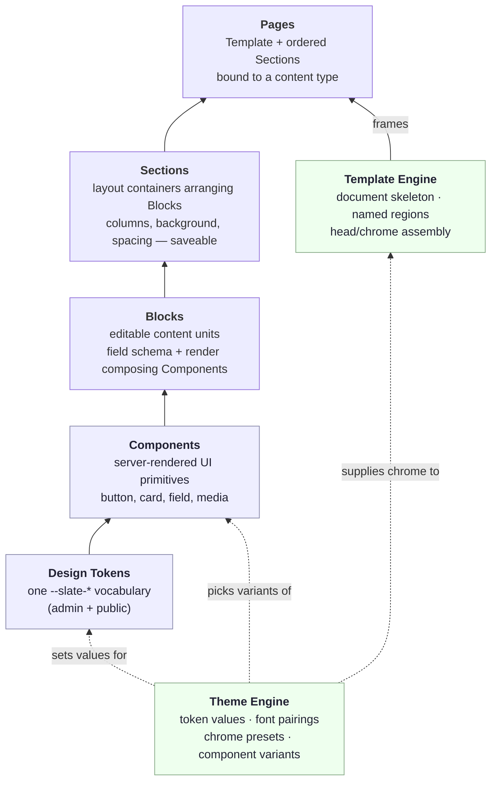

# 05 — Rendering (The Render Stack)

**Status:** Draft · **Applies to:** Slate v1.x → v5.x · **Section anchor**

This section defines the **one rendering pipeline** the whole platform renders
through — [Architecture invariant #6](../01-Architecture/#7-architectural-invariants-must-always-hold):
*every public-facing render goes through the one rendering pipeline.* It replaces
the situation the [audit](../ARCHITECTURE-ROADMAP.md#1-is-the-core-scalable-enough-for-the-vision)
found: **six subsystems each hand-rolling their own HTML document across five
incompatible token vocabularies.** The unified stack is ratified in **ADR-0007**
(Section/Block content model before a visual Page Builder) and **ADR-0008** (one
design-token vocabulary shared by admin + public).

> Read [04-Design-System](../04-Design-System/) first — it owns the two lowest
> layers (Design Tokens, Components). This section owns everything from Blocks
> upward and the pipeline that assembles them.

---

## 1. The problem this section closes

The [roadmap](../ARCHITECTURE-ROADMAP.md#4-how-theme-engine--content-builder--layout--component--page-builder-fit)
documents the current state precisely:

- **6 renderers, each emitting its own `<html>…</html>`:** the admin shell
  (`ui_components.php`), content-builder pages (`Theme.php`), the shop storefront
  (`storefront/includes/layout.php`, with its own hardcoded cream palette and its
  own Google-Fonts pull), the public landing page (`includes/landing.php`), error
  pages (`includes/error_page.php`), and the booking widget. Each defines head
  assembly, chrome, and CSS independently.
- **5 token vocabularies:** `--accent`/`--glass` (admin), `--cb-*`
  (content-builder), `--sb-*` (small-business-kit), landing's `--accent`/`--radius`,
  and the storefront's `--bg`/`--surface`. Accent colour alone is defined in **≥5
  places**.
- **`rx-*` restaurant blocks pollute the core registry** — vertical blocks live in
  `content-builder/lib/BlockRegistry.php` instead of in the restaurant module.
- **`small-business-kit` ships a parallel `sb-*` block/theme/chrome system** into
  the same registry — on an SBK-active site, two chromes render at once.
- **"Layout" is a flat JSON array of blocks** (`Renderer::render(?array $layout)`)
  — no first-class Section or Template to arrange or reuse.

Every one of those is a symptom of the same missing thing: a **single layered
render stack that everything consumes.** That is what this section specifies.

---

## 2. The render stack

Six layers. Data and dependencies flow **strictly upward — each layer consumes
only the one immediately below it, and a Theme skins the whole column by setting
values, never structure.**

| Layer | Is | Owns | Consumes | Home |
|---|---|---|---|---|
| **Design Token** | a themeable CSS custom property `--slate-*` | the styling vocabulary | — | [04-Design-System](../04-Design-System/) |
| **Component** | a presentational, server-rendered UI primitive | markup + variants | Tokens **only** | [04-Design-System](../04-Design-System/) |
| **Block** | an editable content unit (field schema + render) | its schema + render | Components | [blocks-and-sections.md](blocks-and-sections.md) |
| **Section** | a layout container arranging Blocks | columns/background/spacing | Blocks | [blocks-and-sections.md](blocks-and-sections.md) |
| **Page** | a Template + ordered Sections for a content type | the composition | Template, Sections | [blocks-and-sections.md](blocks-and-sections.md) |
| **Template** (frame) | the document skeleton + named regions | head/chrome assembly | Sections, Theme, SEO | [theme-and-template-engine.md](theme-and-template-engine.md) |
| **Theme** (skin) | token values + pairings + chrome presets + variants | *values*, never structure | Tokens, Component contracts | [theme-and-template-engine.md](theme-and-template-engine.md) |

**The one rule.** A layer may reference the layer directly beneath it and no
other. A Block composes Components; it never reaches down to raw tokens or up to
Sections. A Section arranges Blocks; it never renders a Block's internals. This is
the [layer-boundary table](../README.md#layer-boundary-table-what-belongs-where)
made operational — violating it is an architecture violation, not a style
preference.

**Why strict.** Each skipped boundary is a place where a future Theme change, a
token rename, or a component-variant swap silently breaks. The 6-renderer mess
exists *because* nothing enforced these boundaries: the storefront reached past
tokens to hardcode hex; SBK reached past the block layer to inject chrome. Enforce
the seam and those whole classes of drift become impossible.

---

## 3. How a Theme skins it (the orthogonal axis)

Tokens→…→Pages is the **content/structure** axis: what a thing *is*. The Theme
Engine is the **presentation** axis: what it *looks like*. They cross but never
merge.

- A Theme supplies **token values** — it decides `--slate-accent: #2563eb`; it
  never decides that a hero has a heading above a button (that's the Block).
- A Theme selects **component variants** — `button.variant = pill`; it never
  changes the button's markup contract (that's the Component).
- A Theme carries **chrome presets** (header/footer layouts) and **font
  pairings**, handed to the Template Engine.

Because the Theme touches only values and variant *selections*, the *same* theme
skins the admin shell, public CMS pages, the storefront, and transactional email
uniformly. This is exactly what [ADR-0008](../14-ADR/) mandates and what today's
five vocabularies prevent. Detail: [theme-and-template-engine.md](theme-and-template-engine.md).

---

## 4. The boundary answers (the questions this section settles)

Four seams are asked about constantly. The canonical answers:

### 4.1 Theme ↔ Components
**A Theme sets values and picks variants; a Component defines structure.** The
Theme may say "buttons are pill-shaped and accent-coloured with a 12px radius." It
may **not** add a Component, remove one, or alter its markup/DOM. If a design needs
a shape a Component can't express, that's a new **component variant** proposed to
[04-Design-System](../04-Design-System/) — never a Theme reaching into markup.
Test: *swapping the active Theme must never change which HTML elements exist, only
their computed styles.*

### 4.2 Components ↔ Blocks
**A Component is content-blind; a Block owns the content.** A Component renders
whatever props it's handed and has no memory of what it displayed. A Block holds an
editable **field schema**, stores author content, and in its render **composes
Components** to present that content. A Block never emits raw markup that a
Component already provides, and a Component never reads the database or knows a
Block exists. Test: *a Component must be renderable in a style-guide harness with
zero domain data.*

### 4.3 Blocks → Sections
**A Block renders itself; a Section arranges Blocks.** A Block is responsible only
for its own field schema and its own render. It knows nothing about neighbouring
blocks, columns, page background, or vertical rhythm. A **Section** is the
first-class container that arranges an ordered set of Blocks — background, column
grid, spacing — and is **saveable and reusable**. This replaces today's flat
block array. Test: *moving a Block between two Sections changes nothing about how
that Block renders.*

### 4.4 Sections → Pages
**A Section is a reusable band; a Page is the assembled document.** A **Page** is a
**Template choice + an ordered list of Sections + a content-type binding**. The
Page owns *which* Sections in *what* order; the Template owns the document frame
(head, chrome, regions); each Section owns its own internal arrangement. A Page
holds no rendering mechanics of its own. Test: *the same Section definition can
appear on many Pages and in many Templates without modification.*

---

## 5. Where each layer is specified

| Document | Covers |
|---|---|
| [rendering-pipeline.md](rendering-pipeline.md) | the end-to-end flow (resolve→template→sections→blocks→components→head/SEO→cache→emit); the one pipeline serving CMS, storefront, booking widget, API fragments; content-type-aware template selection; draft preview |
| [blocks-and-sections.md](blocks-and-sections.md) | the Block model, the Section model, Page = Template + Sections; `BlockRegistry` / `Block` / `Section` / `Renderer` contract sketches; `blocks.register`; verticals-live-in-their-module rule |
| [theme-and-template-engine.md](theme-and-template-engine.md) | Template Engine (skeleton, named regions, chrome presets) and Theme Engine (values, pairings, variants); how it absorbs `Branding.php` and ends the 6 renderers |
| [page-builder.md](page-builder.md) | the **future** visual Page Builder as a *consumer* of the registry; why the content model comes first (ADR-0007); editor↔schema flow, versioning |
| [assets.md](assets.md) | the Asset Manager: register/fingerprint/dedupe/emit at runtime, no build step; content-hash URLs; critical-CSS inlining; Cloudflare `?v=` scheme |
| [seo-rendering.md](seo-rendering.md) | SEO at the head-assembly stage; the `SeoMetaProvider` contract; JSON-LD; `sitemap.collect` so every module contributes URLs |

---

## 6. Design constraints this section honours

Every decision below is bounded by the [platform constraints](../00-Vision/#4-real-world-constraints-non-negotiable):

- **Flat PHP, no build step.** The stack is a set of PHP classes and PHP block
  templates. There is no compiler between "edit a block" and "refresh." Assets are
  composed at runtime (see [assets.md](assets.md)), not webpacked at deploy.
  ([ADR-0001](../14-ADR/), [ADR-0003](../14-ADR/).)
- **Server-rendered, progressively enhanced.** The pipeline emits complete,
  crawlable HTML. JavaScript (including the future Page Builder) enhances; it is
  never required to see content. ([ADR-0003](../14-ADR/).)
- **Multi-tenant.** Theme values, Sections, Pages, and asset caches are all
  tenant-scoped. One install serves many tenants with different skins through the
  same code path.
- **Backward-compatible migration.** content-builder's `BlockRegistry`/`Renderer`
  is the spine being *promoted*, not replaced — existing blocks keep working while
  Section/Template become first-class around them. ([09-Roadmap](../09-Roadmap/)
  Phase 4.)

---

## 7. Cross-references

- Tokens & Components (the two layers below Blocks): [04-Design-System](../04-Design-System/)
- Per-module rendering (Website/CMS, Shop, Booking): [08-Modules](../08-Modules/)
- Full-page & fragment caching, edge/Cloudflare: [13-Operations](../13-Operations/)
- Decision records: [14-ADR](../14-ADR/) (ADR-0003, ADR-0007, ADR-0008)
- The layer-boundary table this section operationalizes: [hub README](../README.md#layer-boundary-table-what-belongs-where)
