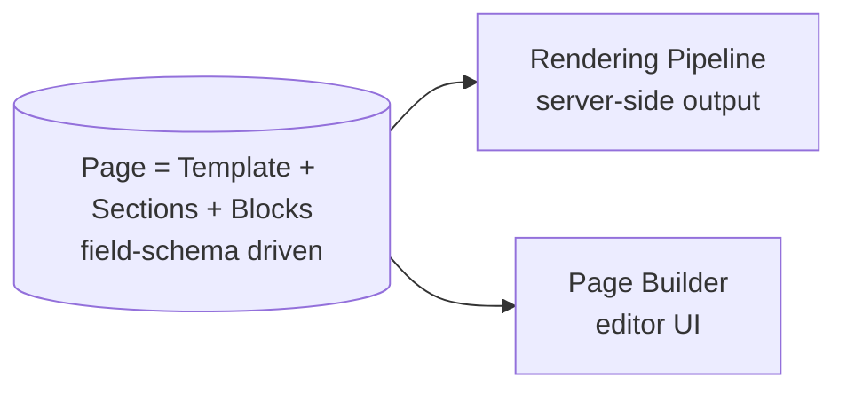

# 05 — Visual Page Builder (Future)

**Status:** Draft · **Applies to:** Slate v2.x

The future drag-and-drop editor for assembling Pages from Sections and Blocks. It
is deliberately specified **after** the content model ([blocks-and-sections.md](blocks-and-sections.md))
and defined as a **consumer** of that model — not a second rendering path
(ADR-0007).

> **Why the model comes first.** Today ([AUDIT-BRIEFING](../AUDIT-BRIEFING.md))
> the block editor is up/down reordering over a flat JSON array, and layout has no
> first-class Section/Template. Building a visual builder on that would bake the
> gaps in. Sections/Templates/one-registry land first (v1–v2); the builder is the
> UI on top.

---

## 1. Core principle: one model, two consumers



The Page Builder and the Rendering Pipeline read the **same** Block schemas and
the **same** Section/Page objects. The builder never invents markup; it
manipulates the model and asks the pipeline to preview it. This guarantees
what-you-edit-is-what-renders.

---

## 2. What the builder does

| Capability | Backed by |
|---|---|
| Add/remove/reorder Sections (drag) | `Page.sections[]` |
| Add/remove/reorder Blocks within a Section | `Section.blocks[]` |
| Edit a Block's fields | the Block's `schema()` → generated form |
| Set Section layout (cols/bg/spacing) | `Section.layout` (`LayoutSpec`) |
| Save a Section as a reusable pattern | `Section.savedAs` |
| Pick a Template | content-type templates |
| Live preview | the Rendering Pipeline in preview mode |
| Revisions / undo | the revisions store (§4) |

The editor form for **every** Block is generated from its field schema — no
per-block editor code, so a new module Block is instantly editable.

---

## 3. Editor ↔ schema flow

```
Block.schema()  ──►  generated field form  ──►  edited props
        ▲                                            │
        └──────────  Page model (JSON)  ◄────────────┘
                            │
                            ▼
              Rendering Pipeline (preview)  ──►  iframe preview
```

Persistence is the same Section/Block JSON the server renders. The builder is a
thin client over it; disabling JS still leaves a server-rendered, editable
fallback (progressive enhancement — [00-Vision](../00-Vision/)).

---

## 4. Revisions

Pages gain a **revisions** store (absent today, noted as a v2 need): each save
snapshots the model, enabling undo, draft/preview vs published, and rollback.
Draft preview is already a pipeline mode ([rendering-pipeline.md](rendering-pipeline.md)).

---

## 5. Extensibility

- A module's Blocks appear in the builder automatically once registered via
  `blocks.register` — no builder changes.
- Section patterns and Template presets are data; tenants and modules can ship
  libraries of them.
- The builder respects [permissions](../10-Security/authorization-rbac.md): who
  may edit which content types.

---

## 6. Sequencing

Ships in **v2.x**, only after: one token vocabulary, one Component Library, the
core Block Registry, and first-class Sections/Templates all exist
([09-Roadmap](../09-Roadmap/implementation-roadmap.md)). Building it earlier means
rebuilding it — the exact trap ADR-0007 avoids.

---

## Related

- [blocks-and-sections.md](blocks-and-sections.md) · [rendering-pipeline.md](rendering-pipeline.md) · [theme-and-template-engine.md](theme-and-template-engine.md)
- [08-Modules/website-cms.md](../08-Modules/website-cms.md) · [ADR-0007](../14-ADR/)
