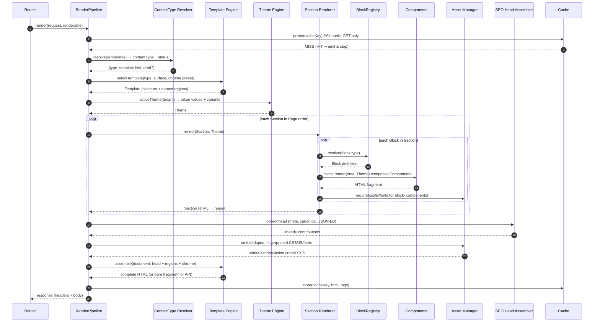

# 05 — Rendering Pipeline

**Status:** Draft · **Applies to:** Slate v1.x → v5.x · **The one pipeline**

This document specifies the **single end-to-end rendering pipeline** every
public-facing surface renders through — the operational form of
[Architecture invariant #6](../01-Architecture/#7-architectural-invariants-must-always-hold):
*every public-facing render goes through the one rendering pipeline.* It is the
resolution of the six-renderer problem the [audit](../AUDIT-BRIEFING.md) found and
is ratified by [ADR-0007](../14-ADR/) and [ADR-0008](../14-ADR/).

Read the [section README](README.md) (the render stack, the six-renderer problem)
first; this document is the *flow through* that stack. The layers it moves through
are specified in [blocks-and-sections.md](blocks-and-sections.md) and
[theme-and-template-engine.md](theme-and-template-engine.md).

---

## 1. WHAT — one pipeline, four surfaces

There is exactly one code path that turns a resolved request into rendered output.
It serves **all four** of Slate's rendering surfaces:

| Surface | Example request | What the pipeline emits |
|---|---|---|
| **CMS page** | `/p/about`, `/services/coaching` | full HTML document (Template + Sections) |
| **Storefront** | `/shop`, `/shop/product/mug` | full HTML document, same Template Engine |
| **Booking widget** | `/book`, embedded iframe | full HTML document with a widget chrome preset |
| **API fragment** | `GET /api/v1/blocks/hero.json`, HTMX partial | a rendered Section/Block fragment, no chrome |

Every one of these resolves to *the same thing* — an ordered set of **Sections**,
each an ordered set of **Blocks**, each composing **Components** styled by
**Tokens** — assembled inside a **Template**, skinned by the active **Theme**, with
a **head** carrying SEO + assets, then cached and emitted. The surfaces differ only
in *which Template/chrome preset is selected* and *whether a full document or a
bare fragment is emitted* — never in the render mechanics.

This is the invariant made concrete: there is nowhere else HTML is born.

---

## 2. WHY — what the six renderers cost

Today six subsystems each hand-roll their own `<html>…</html>` (see
[README §1](README.md#1-the-problem-this-section-closes)): the admin shell
(`ui_components.php`), content-builder pages (`Theme.php`), the shop storefront
(`storefront/includes/layout.php` with its own hardcoded palette and its own
Google-Fonts pull), the landing page (`includes/landing.php`), error pages
(`includes/error_page.php`), and the booking widget. Each independently decides
head assembly, chrome, token emission, and asset loading. The direct consequences:

1. **Six places to fix one head bug.** A missing `<meta name="viewport">`, a wrong
   canonical, a CSP header — each must be repaired in six files, and drifts the
   moment one is missed.
2. **Divergent SEO.** Only content-builder emits managed meta; the storefront,
   landing, and booking widget each do their own thing or nothing. There is no
   single head-assembly stage for [seo-rendering.md](seo-rendering.md) to hook.
3. **Divergent assets.** The storefront pulls Google Fonts over the network while
   content-builder inlines CSS; there is no shared dedupe, so a page running both
   loads two font stacks and two token sets ([assets.md](assets.md)).
4. **No caching seam.** Because each renderer is its own path, there is no single
   place to probe or store a full-page cache ([13-Operations](../13-Operations/)).

One pipeline gives every surface *one* head-assembly stage, *one* asset stage, and
*one* cache seam — so an SEO fix, a security header, or a performance win lands
once and applies everywhere.

---

## 3. HOW — the stages, in order

The pipeline is a fixed sequence of stages. Everything before **Resolve** is the
request lifecycle ([01-Architecture §4](../01-Architecture/#4-request--response-lifecycle-summary));
the pipeline *is* the lifecycle's **Render** step (step 8), expanded.



Stage by stage:

1. **Resolve.** The router has already matched the request to a **renderable** — a
   CMS Page, a storefront view, a booking step, or an API fragment request — and a
   tenant. The pipeline receives that renderable; it does not route.
2. **Cache probe.** For cacheable requests (public GETs, no auth-varying state) the
   pipeline checks the full-page cache first; a hit emits and stops before any
   render work. Detail: [13-Operations](../13-Operations/).
3. **Content-type resolution.** The renderable declares its **content type**
   (`page`, `product`, `booking-step`, `blog-post`, `error`, `fragment`) and its
   publication status (published / draft / scheduled). This drives template
   selection and SEO defaults — see §4 and §5.
4. **Template selection.** The Template Engine picks the document skeleton and
   chrome preset for this content type + surface (full page vs widget vs fragment).
   → [theme-and-template-engine.md](theme-and-template-engine.md).
5. **Theme resolution.** The active Theme for the tenant is loaded once: token
   values, font pairings, chrome presets, component variants. Emitted a single time
   into the head (→ [design-tokens.md §6](../04-Design-System/design-tokens.md#6-how-emitted-once-per-response)).
6. **Section → Block → Component render.** For each Section in Page order, for each
   Block in the Section, the **BlockRegistry** resolves the Block definition, the
   Block's `render` composes **Components**, and each Block/Component **requires**
   its assets (registered, not yet emitted). This is the strict-upward stack from
   [README §2](README.md#2-the-render-stack).
7. **Head assembly (SEO + assets).** The SEO stage collects meta/canonical/OG/
   JSON-LD from every renderable via the `SeoMetaProvider` contract
   ([seo-rendering.md](seo-rendering.md)); the Asset Manager emits the **deduped,
   fingerprinted** CSS/JS/fonts the render actually required, plus inlined critical
   token CSS ([assets.md](assets.md)).
8. **Document assembly.** The Template Engine places the rendered Sections into its
   named regions and wraps them in chrome + head. For an **API fragment** this
   stage is skipped: the bare Section/Block HTML is returned with no chrome.
9. **Cache store.** The assembled output is stored under a tenant- and
   context-scoped key with invalidation **tags** (page id, block type, theme
   version) so a later content or theme change purges precisely.
10. **Emit.** Response headers (security, cache-control) + body. Queued events/jobs
    (e.g. `page.rendered`) fire after response, off the request path.

---

## 4. HOW — content-type-aware template selection

The pipeline never hardcodes "which template." It asks the Template Engine to
select one from the resolved **content type** and **surface**, in a fixed
precedence so a tenant can override without touching code:

```
1. Explicit page override      (this Page pins template "landing-wide")
2. Content-type default        (content type "product" → template "storefront-product")
3. Surface default             (surface "widget" → template "embed-bare")
4. Platform fallback           (template "document")
```

**WHY content-type-aware.** The six renderers each *were* a template hardcoded to
one content type — the storefront template could only render shop pages, the
landing renderer only the landing page. Making the content type an input means one
Template Engine serves every type, and a new content type (say a restaurant menu)
selects an existing template or registers its own **without a new renderer**. The
`rx-*` restaurant blocks that pollute the core registry today
([README §1](README.md#1-the-problem-this-section-closes)) exist partly because
there was no clean per-content-type template seam; there is now.

Chrome presets (full header/footer, minimal, widget-embed, email) are a Theme
concern the Template Engine consumes — so selecting the "widget" surface for the
booking flow yields the booking widget's stripped chrome *through the same engine*
that renders a full CMS page. → [theme-and-template-engine.md](theme-and-template-engine.md).

---

## 5. HOW — draft preview through the same path

Preview is **not** a second renderer. A draft renders through the identical
pipeline with two inputs flipped:

- **Content source = working revision**, not the published one. The Resolve stage
  loads the unpublished Section/Block JSON for the previewing author.
- **Cache = bypassed**, and the emitted document is marked `noindex` by the SEO
  stage (draft/scheduled status from step 3 → robots directive in
  [seo-rendering.md](seo-rendering.md)).

**WHY the same path.** The whole value of preview is *fidelity* — what the author
sees must be byte-for-byte what visitors will get. A separate preview renderer
(one of the ways the six multiplied) guarantees drift: the preview looks right and
production doesn't. Routing draft content through the one pipeline makes preview
correct by construction and gives the future visual Page Builder its live preview
for free — the Builder is a **consumer** of this pipeline, not a new one
([page-builder.md](page-builder.md), [ADR-0007](../14-ADR/)).

---

## 6. Constraints this pipeline honours

- **Flat PHP, no build step.** Every stage is a PHP method; Blocks and Templates
  are PHP render functions. Nothing is compiled between edit and refresh. Assets
  are composed at runtime, not bundled at deploy ([assets.md](assets.md),
  [ADR-0001](../14-ADR/)/[ADR-0003](../14-ADR/)).
- **Server-rendered, progressively enhanced.** The pipeline emits complete,
  crawlable HTML before any JavaScript runs. The API-fragment surface is what lets
  progressive enhancement (HTMX-style swaps) re-render a Section without a client
  framework — same pipeline, chrome stage skipped ([ADR-0003](../14-ADR/)).
- **Multi-tenant.** Cache keys, Theme values, and content are tenant-scoped; one
  install renders many tenants' differently-skinned pages through this one path.
- **Backward-compatible.** content-builder's `Renderer::render(?array $layout)` is
  the spine being *promoted* into this pipeline, not replaced — existing flat block
  arrays render as a single implicit Section while Sections/Templates become
  first-class around them ([09-Roadmap](../09-Roadmap/) Phase 4).

---

## 7. Cross-references

- The layers this pipeline traverses: [blocks-and-sections.md](blocks-and-sections.md),
  [theme-and-template-engine.md](theme-and-template-engine.md).
- Tokens & Components below Blocks: [04-Design-System](../04-Design-System/).
- Head-stage SEO and per-module sitemap contribution: [seo-rendering.md](seo-rendering.md).
- Runtime asset register/dedupe/emit: [assets.md](assets.md).
- The visual editor that consumes this pipeline: [page-builder.md](page-builder.md).
- Full-page/fragment caching and edge: [13-Operations](../13-Operations/).
- Per-module render specifics (CMS, Shop, Booking): [08-Modules](../08-Modules/).
- Decisions: [ADR-0007](../14-ADR/), [ADR-0008](../14-ADR/), [ADR-0003](../14-ADR/).
