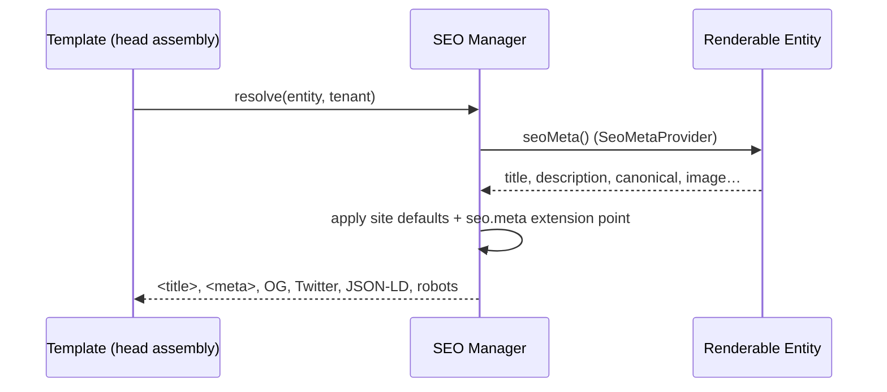

# 05 — SEO in the Rendering Pipeline

**Status:** Draft · **Applies to:** Slate v1.x → v5.x

Where and how SEO is produced. SEO is a **platform service that every renderable
entity feeds** — not a content-CMS feature. Because Slate is server-rendered
([00-Vision](../00-Vision/)), content is crawlable by default; this document is
about the *managed metadata* layered on top.

> **Problem being solved.** Today ([AUDIT-BRIEFING](../AUDIT-BRIEFING.md)) the SEO
> plugin is content-builder-specific and currently inactive, so the live site has
> no managed meta. Making SEO a pipeline stage fed by a contract means products,
> booking services, courses, and blog posts all get meta and sitemaps — not just
> CMS pages.

---

## 1. Integration point: the head-assembly stage

The [rendering pipeline](rendering-pipeline.md) has a head-assembly stage inside
the Template. The **SEO Manager** runs there, resolves the entity's metadata, and
emits it:



---

## 2. The entity contract

Any entity that can be a page implements `SeoMetaProvider`:

```php
interface SeoMetaProvider {
    public function seoMeta(RenderContext $ctx): MetaBag;   // title, description, canonical, image, type, noindex
}
```

- A CMS Page, a Shop Product, a Booking Service, an LMS Course, a blog Post each
  implement it — so **every module** contributes SEO without the SEO code knowing
  about that module.
- The `seo.meta` extension point ([06-SDK/event-catalogue.md](../06-SDK/event-catalogue.md))
  lets modules augment another entity's meta (e.g. add a product image).
- Site-wide defaults + per-entity overrides merge; per-entity wins.

---

## 3. What the SEO Manager emits

| Output | Source |
|---|---|
| `<title>`, `<meta name=description>` | entity meta + defaults |
| `<link rel=canonical>` | entity canonical (dedup/pagination-aware) |
| Open Graph + Twitter Card | entity meta + Media (image) |
| `robots` (index/noindex, follow) | entity flag (drafts = noindex) |
| **JSON-LD** structured data | per content type (Product, Article, Event, Course…) |

JSON-LD is generated per content type so rich results work across verticals — a
Booking Service emits `Event`/`Service`, a Product emits `Product`, a course
emits `Course`.

---

## 4. Sitemap & robots (cross-module)

- **`sitemap.xml`** is built from the `sitemap.collect` event: every module
  contributes its public URLs (products, services, courses, pages) with
  lastmod/priority. The SEO Manager assembles and caches the result. No module
  owns "the sitemap"; all contribute to it.
- **`robots.txt`** is generated with a per-tenant admin override.
- Both are public routes served by the SEO service, tenant-aware, and cached
  ([13-Operations](../13-Operations/performance-and-caching.md)).

---

## 5. Caching interaction

Resolved meta is part of the full-page cache entry (keyed with the content
version), so steady-state responses emit SEO with no recomputation; a content
edit invalidates the entry and the next render re-resolves meta. Sitemaps are
rebuilt on a schedule/queue, not per request.

---

## Related

- [rendering-pipeline.md](rendering-pipeline.md) · [theme-and-template-engine.md](theme-and-template-engine.md)
- [08-Modules](../08-Modules/) · [06-SDK/event-catalogue.md](../06-SDK/event-catalogue.md) · [13-Operations/performance-and-caching.md](../13-Operations/performance-and-caching.md)
