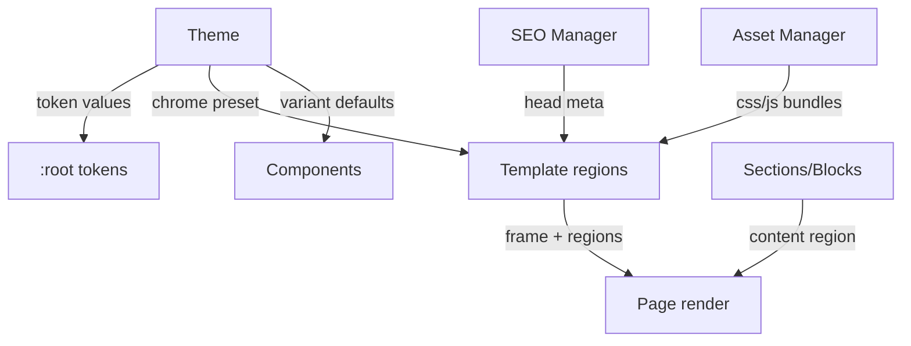

# 05 — Theme & Template Engine

**Status:** Draft · **Applies to:** Slate v1.x → v5.x

Two collaborating systems: the **Template Engine** (the document skeleton — head
assembly, chrome, and named regions) and the **Theme Engine** (the values and
presets that skin everything). Together they end the six-divergent-renderers
problem: one document frame, one skin, applied to admin, public pages,
storefront, and email alike.

> **Problem being solved.** Today ([AUDIT-BRIEFING](../AUDIT-BRIEFING.md)) six
> subsystems each hand-roll their own `<html>` document with their own token
> vocabulary, and content-builder's `Branding.php` presets are trapped inside one
> plugin. The Theme + Template engines absorb that into a single, tenant-themed
> pipeline (ADR-0008).

---

## 1. Template Engine — the document skeleton

A **Template** owns the frame a Page renders into: the `<html>`/`<head>`
assembly, header/footer chrome, and **named regions** that Sections slot into.

```php
interface Template {
    public function name(): string;                 // 'default', 'landing', 'storefront'
    public function regions(): array;                // ['header','content','sidebar','footer']
    public function render(RegionContent $regions, RenderContext $ctx): string; // full document
}
```

- **Named regions.** `header`, `content`, `footer`, optional `sidebar`. Sections
  render into `content`; chrome presets fill `header`/`footer`.
- **Content-type-aware selection.** A `product` page picks the storefront
  template; a `landing` page picks the minimal one — resolved in the
  [pipeline](rendering-pipeline.md).
- **Head assembly is a pipeline stage** where the [SEO Manager](seo-rendering.md)
  and the [Asset Manager](assets.md) inject meta and asset bundles.
- **One frame for all surfaces.** Admin, public, storefront, and transactional
  email all render through templates — no bespoke documents.

## 2. Theme Engine — the skin

A **Theme** is a bundle that *skins* the frame without changing its structure:

| Theme carries | Feeds |
|---|---|
| **Token values** (color/space/radius/font) | [Design Tokens](../04-Design-System/design-tokens.md) at `:root` |
| **Font pairings** (system-font stacks, no external fetch by default) | token `--slate-font-*` |
| **Chrome presets** (header/footer variants) | Template regions |
| **Component variants** (default tone/size choices) | Component Library |

```php
interface Theme {
    public function tokens(): array;         // --slate-* overrides for this tenant
    public function fontPairing(): FontPair;
    public function chrome(): ChromePreset;  // header + footer variant
    public function componentDefaults(): array;
}
```

- **Values, never structure** ([boundary table](../README.md#layer-boundary-table-what-belongs-where)).
  A Theme changes how things look; it never changes what a Component or Block *is*.
- **Per-tenant.** Each tenant selects a Theme + overrides; the resolved token set
  is emitted once at `:root` ([design-tokens.md](../04-Design-System/design-tokens.md)).
- **Absorbs `Branding.php`.** The 8 palettes / font pairings / header-footer
  preset libraries that live in content-builder today become Theme Engine data
  available platform-wide.
- **Contrast-safe** ([accessibility.md](../04-Design-System/accessibility.md)):
  the theme validator checks token pairs at save time.

## 3. How they collaborate with the render stack



The Template provides the *frame*; Sections/Blocks provide the *content*; the
Theme provides the *skin*; SEO + Assets fill the *head*. Swap the Theme and every
page re-skins; swap the Template and the frame changes — content untouched either
way.

---

## 4. Email & non-page surfaces

Transactional email ([08-Modules/notifications.md](../08-Modules/notifications.md))
uses email-safe Templates + the same Theme tokens (inlined), so a tenant's
receipts match their site without a separate design system.

---

## Related

- [README.md](README.md) · [blocks-and-sections.md](blocks-and-sections.md) · [rendering-pipeline.md](rendering-pipeline.md) · [assets.md](assets.md) · [seo-rendering.md](seo-rendering.md)
- [04-Design-System](../04-Design-System/) · [ADR-0008](../14-ADR/)
