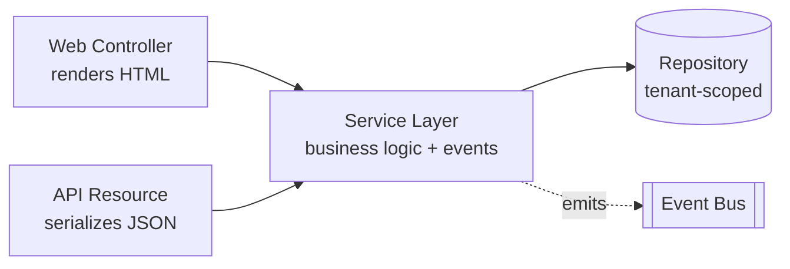

# 07 — HTTP / REST API

**Status:** Draft · **Applies to:** Slate v1.x → v5.x · **Anchor document**

This section defines Slate's **programmatic surface** — the versioned HTTP/REST API
through which external clients, first-party JavaScript, headless front ends, and
eventually a third-party ecosystem drive the platform. It is the network-facing
twin of the [SDK](../06-SDK/): the SDK is what *code inside the process* builds
against; the API is what *code across the wire* builds against.

Read [00-Vision](../00-Vision/) (principle 6, "stable semver'd SDK") and
[01-Architecture §4](../01-Architecture/README.md#4-request--response-lifecycle-summary)
(the shared web+API lifecycle) first — this section is how those promises reach
the network.

---

## 1. The one rule everything hangs on

> **Web controllers and API resources are two thin adapters over the *same*
> service layer.** Neither contains business logic. A booking made through the
> `/book` widget and a booking made through `POST /api/v1/appointments` execute
> the *identical* service call, tenancy scoping, policy check, and event
> emission. The only difference is the edge: one renders HTML, the other
> serializes a resource.



**WHAT.** Every endpoint is a *serialization adapter*. It (1) parses and validates
the request, (2) resolves the principal and tenant, (3) authorizes via the policy
engine, (4) calls one service method, (5) serializes the return value into a
resource envelope. Steps 2–3 are middleware shared with the web path
([01-Architecture §4](../01-Architecture/README.md#4-request--response-lifecycle-summary),
lifecycle steps 3–6); step 4 is the same service method the web controller calls.

**WHY.** This is what makes Slate *headless-capable and SaaS-ready without a
rewrite*. The moment logic lives in a controller, it exists in exactly one edge:
a mobile app, a partner integration, or a React front end cannot reach it without
copy-pasting or scraping HTML. Today the codebase has this failure in miniature —
`ShopAPI::createOrder()` supports coupons but the storefront checkout has no
coupon field, because *cart totals and order totals are computed by two different
code paths* ([AUDIT-BRIEFING §9](../AUDIT-BRIEFING.md)). Two code paths for one
concept is exactly the bug the shared-service rule retires. If both the cart view
and the checkout endpoint call the same `Cart::totals()` service, the coupon field
cannot exist in one and not the other.

**HOW.** A resource controller is mechanically boring:

```php
// GET /api/v1/appointments/{id}
final class AppointmentResource extends Slate\Sdk\ApiResource {
    public function show(Request $req, string $id): Response {
        // 2–3 (tenant + principal + policy) already ran as middleware.
        $appt = $this->appointments->find($id);          // 4: ONE service call
        $this->authorize('booking.appointment.view', $appt);
        return $this->ok($appt);                          // 5: serialize + envelope
    }
}
```

No SQL, no `Database::setting()`, no money arithmetic, no Stripe call. If a
resource controller grows a second responsibility, that responsibility belongs in
the service. This is [invariant #5](../01-Architecture/README.md#7-architectural-invariants-must-always-hold)
(resolve from the container, never `new` across a boundary) applied at the edge.

---

## 2. Surface shape

| Aspect | Decision |
|---|---|
| Base path | `/api/v1/` under the install root (so `/slate/api/v1/…` on the subpath deploy — base-path aware, never hard-coded) |
| Transport | HTTPS only; HTTP is redirected (force-HTTPS + HSTS are already core) |
| Format | JSON request and response bodies; `application/json` by default |
| Entry point | The single front controller — the API is *not* a separate app; it is lifecycle steps 1–9 with a serializing dispatcher ([01-Architecture §3.1](../01-Architecture/README.md#31-runtime--bootstrap)) |
| Statelessness | No server session for API clients; every request carries its own credential (see [authentication.md](authentication.md)) |
| Tenancy | Resolved from the credential + host/subpath, injected into every service exactly as on the web path; a token minted for tenant A can never read tenant B ([multi-tenancy](../01-Architecture/multi-tenancy.md)) |

The API lives behind the same `.htaccess` and the same front controller as the web
app; it is a **content-negotiated view of the platform**, not a bolt-on. This is
the flat-PHP, shared-hosting–friendly realization of "one deployable, many edges"
([00-Vision §3](../00-Vision/README.md#3-design-principles), modular monolith).

---

## 3. Resource modeling

Resources map to **domain concepts owned by a service or module**, never to raw
tables. The URL names the concept; the owning service decides how it is stored.

| Resource | Owner | Notes |
|---|---|---|
| `/api/v1/contacts` | Identity service | The single person/organization model — one `contacts` row, many module profiles ([02-Domain](../02-Domain/), [invariant #4](../01-Architecture/README.md#7-architectural-invariants-must-always-hold)) |
| `/api/v1/appointments` | Booking module | |
| `/api/v1/orders` | Shop module | Totals as **Money** (see §6) |
| `/api/v1/products` | Shop module | |
| `/api/v1/memberships` | Membership module | Layered on core customers via the MembershipAPI capability |
| `/api/v1/forms` · `/api/v1/forms/{id}/submissions` | Forms module | |
| `/api/v1/charges` · `/api/v1/refunds` | Payments service | Provider-agnostic; see [payments.md](payments.md) |
| `/api/v1/media` | Media service (core) | |
| `/api/v1/webhooks` (subscriptions) | API service | Outbound delivery config; see [webhooks.md](webhooks.md) |

**Modules register their own resources** through the manifest, exactly as they
register web routes — declaratively, so the kernel can enumerate the API surface
without booting every module ([06-SDK manifest](../06-SDK/manifest.md)). A module
may only expose resources over tables it owns; it may not publish an endpoint that
reads another module's tables ([invariant #1](../01-Architecture/README.md#7-architectural-invariants-must-always-hold)).
Cross-module data in a response is assembled by the owning services, not by a
join across boundaries.

### 3.1 Standard verbs and collection/member pattern

| Verb | Collection `/orders` | Member `/orders/{id}` |
|---|---|---|
| `GET` | List (paginated, filterable) | Fetch one |
| `POST` | Create → `201` + `Location` | — |
| `PATCH` | — | Partial update |
| `PUT` | — | Full replace (rare; prefer PATCH) |
| `DELETE` | — | Delete/soft-delete → `204` |

Sub-resources express ownership: `/orders/{id}/refunds`,
`/forms/{id}/submissions`. Actions that are not CRUD are modeled as sub-resource
POSTs, not RPC verbs in the path — e.g. `POST /orders/{id}/refunds` rather than
`POST /orders/{id}/refund`. State changes always go through the service, never a
direct field write.

---

## 4. Pagination

Cursor-based by default; page-based offered for small admin lists where a client
needs jump-to-page. Cursors are opaque, tenant-scoped, and stable under
concurrent inserts.

```
GET /api/v1/orders?limit=50&cursor=eyJpZCI6MTk4M30
```

```json
{
  "data": [ { "type": "order", "id": "1984", "...": "..." } ],
  "pagination": {
    "limit": 50,
    "next_cursor": "eyJpZCI6MjAzM30",
    "prev_cursor": "eyJpZCI6MTkzNH0",
    "has_more": true
  }
}
```

Rules: `limit` has a hard ceiling (default cap 100) so a client cannot ask the
shared-hosting DB for an unbounded scan; a missing `next_cursor` means the end;
cursors encode a tenant fingerprint so a cursor from one tenant is rejected under
another. Never expose `OFFSET` on large collections — it degrades on exactly the
single-DB deployment Slate targets ([00-Vision §4](../00-Vision/README.md#4-real-world-constraints-non-negotiable)).

---

## 5. Filtering, sorting, sparse fields

Uniform, declarative query grammar so every collection filters the same way:

| Concern | Syntax | Example |
|---|---|---|
| Filter | `filter[field]=value`, operators via suffix | `filter[status]=paid`, `filter[created_at][gte]=2026-01-01` |
| Sort | `sort=field` / `sort=-field` (desc) | `sort=-created_at` |
| Sparse fields | `fields[type]=a,b,c` | `fields[order]=id,total,status` |
| Include relations | `include=rel1,rel2` | `include=customer,line_items` |
| Search | `q=` (module decides the index) | `q=smith` |

A module's service **whitelists** which fields are filterable/sortable — an
unknown `filter[]` key is a `422` with a field error (see
[versioning-and-errors.md](versioning-and-errors.md)), never a silent full-table
scan or an injection surface. Filtering is applied inside the tenant-scoped
repository, so a filter can never widen visibility past the tenant boundary.

---

## 6. Money on the wire (invariant #3)

Every monetary value in a request or response is a **Money** object — an integer
of minor units plus an ISO-4217 currency — never a decimal string, never a float,
never a bare number the client must guess the scale of.

```json
{ "total": { "amount": 4999, "currency": "USD" } }
```

`4999` `USD` is **$49.99**. The client reads the currency's exponent to format; it
never divides by 100 blindly (JPY has exponent 0, BHD has 3).

**WHY this is a hard rule, not a style preference.** Today the shop stores money as
`DECIMAL(12,2)` and manipulates it with `(float)` casts, then converts to Stripe's
integer cents with `(int) round((float)$order['total'] * 100)`
([AUDIT-BRIEFING](../AUDIT-BRIEFING.md); `plugins/shop/ShopAPI.php`). That round
trip — decimal → float → rounded cents — is a rounding-bug generator and it means
the *shop* and the *gateway* disagree about representation at the exact boundary
where money must be exact. Serializing Money as `{amount, currency}` end to end
means the value that leaves the DB, crosses the API, and reaches the
`PaymentGateway` is the *same integer* the whole way. See
[11-Database](../11-Database/) for the `Money` value object and
[ADR-0011](../14-ADR/) for the decision; [payments.md](payments.md) for how the
gateway consumes it.

The API layer **rejects** a monetary field sent as a bare number or decimal string
with a `422` — clients are forced onto the safe representation.

---

## 7. Content negotiation

- **Request:** `Content-Type: application/json`. A malformed body is a `400` with
  the standard error envelope, never a PHP notice
  ([invariant: errors never leak](../10-Security/)).
- **Response:** `application/json` for resources. Media/binary downloads redirect
  to a signed, time-limited URL from the Media service rather than streaming
  through the API.
- **Versioning:** the major version is in the path (`/api/v1/`); minor, additive
  changes never break a client. Deprecation is signaled by headers. Full policy in
  [versioning-and-errors.md](versioning-and-errors.md).
- **Compression / caching:** `mod_deflate` and the platform cache tiers apply;
  cacheable GETs carry `ETag`/`Cache-Control`; conditional requests
  (`If-None-Match`) return `304`.

---

## 8. Where the rest of this section lives

| Document | Defines |
|---|---|
| [authentication.md](authentication.md) | PATs, OAuth2 (client-credentials + auth-code), scopes → RBAC policy engine, rate limiting |
| [webhooks.md](webhooks.md) | Outbound event subscriptions, HMAC signing, SSRF protection, delivery logs; inbound (Stripe) verification |
| [payments.md](payments.md) | The `PaymentGateway` capability, charges/ledger, provider drivers, and the consumer-decoupling rule |
| [versioning-and-errors.md](versioning-and-errors.md) | API versioning, deprecation policy, the standard error envelope |

**Related sections:** [06-SDK](../06-SDK/) (the in-process twin of this surface),
[10-Security](../10-Security/) (authn/authz, error handling), [11-Database](../11-Database/)
(repositories, `Money`, tenancy scoping), [01-Architecture](../01-Architecture/)
(shared lifecycle, service layer, events), [14-ADR](../14-ADR/) (the decisions),
[08-Modules](../08-Modules/) (per-module resource specs).
