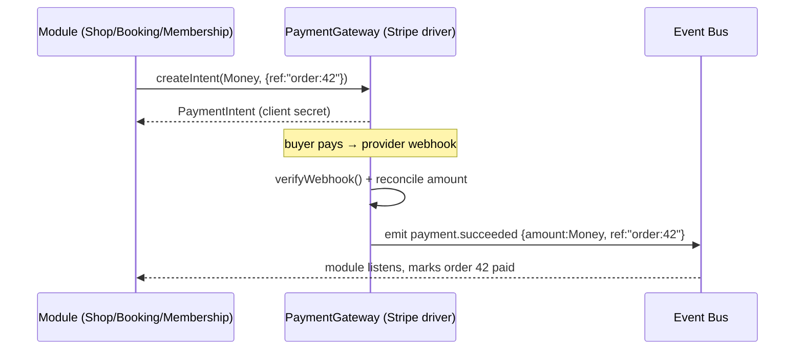

# 07 — Payment Architecture

**Status:** Draft · **Applies to:** Slate v1.x → v5.x

How money moves through Slate — provider-agnostic, `Money`-typed, and decoupled
from the modules that take payments. Realizes invariant #7 (payments flow only
through `PaymentGateway`), invariant #3 (`Money` everywhere), and ADR-0011.

> **Problem being solved.** Today ([AUDIT-BRIEFING](../AUDIT-BRIEFING.md)) Stripe
> is genuinely centralized (good) **but** the gateway is bidirectionally coupled
> to Shop — `stripe-payment`'s endpoints hard-depend on `ShopAPI`. And `shop`
> stores money as `DECIMAL` while the gateway expects integer cents, so every
> shop↔Stripe handoff is a float→cents conversion. This document removes both:
> one generic gateway contract, `Money` end to end.

---

## 1. The `PaymentGateway` capability

Consumers depend on a capability, never on a provider class:

```php
interface PaymentGateway {
    public function createIntent(Money $amount, PaymentContext $ctx): PaymentIntent;
    public function capture(string $intentId): Charge;
    public function refund(string $chargeId, Money $amount): Refund;
    public function verifyWebhook(Request $r): WebhookEvent;   // signature + replay window
}
```

`PaymentContext` is **generic** — a reference string, description, and metadata.
It carries **no module types**. The gateway knows nothing about orders, bookings,
or memberships.

## 2. The decoupling rule (the key fix)



- The gateway **never calls back into a module.** It emits
  `payment.succeeded`/`payment.refunded` with the `Money` amount and the opaque
  `ref`. The module **reconciles by listening**. (Ends shop↔stripe bidirectional
  coupling — a dependency cycle the resolver would now forbid anyway.)
- **Amount reconciliation** happens in the gateway against the intent, parking
  mismatches for review (preserving today's hardening, generalized to all
  consumers).

## 3. `Money`, everywhere

- All amounts crossing the gateway are `Money` (integer minor units + currency).
  No floats, no `DECIMAL` for money ([11-Database/schema-conventions.md](../11-Database/schema-conventions.md)).
- Shop's `DECIMAL` columns migrate to minor-unit integers ([09-Roadmap Phase 3](../09-Roadmap/refactor-roadmap.md)),
  removing the conversion boundary entirely.

## 4. The charges ledger

A cross-provider `charges` ledger records every intent/charge/refund with
`(tenant_id, provider, intent_id)` / `(tenant_id, session_id)` unique keys so
concurrent webhooks can't double-insert. It is the reconciliation source of truth
and the basis for refunds and reporting.

## 5. Providers as drivers

| Driver | Status | Notes |
|---|---|---|
| Stripe (hosted + Payment Element) | now | the reference driver |
| Stripe Terminal | now (restaurant) | in-person; same contract |
| PayPal / Square | later | new drivers, same `PaymentGateway` contract |

Adding a provider is a new driver implementing `PaymentGateway` — no consumer
changes. A tenant selects the active provider in settings.

## 6. Webhooks

Inbound provider webhooks are verified (HMAC + replay window) by
`verifyWebhook()` and translated into `payment.*` domain events. Outbound
webhooks (notifying external systems of `payment.succeeded`) go through the
general [webhook framework](webhooks.md).

---

## Related

- [README.md](README.md) · [webhooks.md](webhooks.md) · [authentication.md](authentication.md)
- [06-SDK/base-classes-and-contracts.md](../06-SDK/base-classes-and-contracts.md) · [11-Database](../11-Database/) · [ADR-0011](../14-ADR/)
