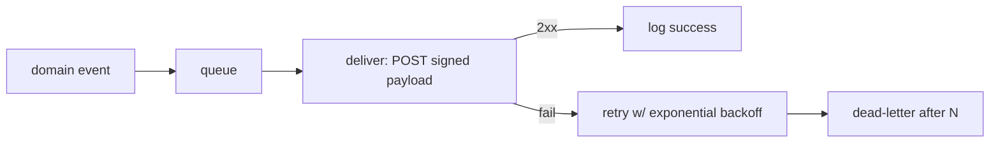

# 07 — Webhooks

**Status:** Draft · **Applies to:** Slate v1.x → v5.x

Two directions: **outbound** webhooks (Slate notifying external systems when a
domain event happens) and **inbound** webhooks (external providers notifying
Slate). Both are platform services so modules never hand-roll delivery or
verification.

> **Problem being solved.** Today ([AUDIT-BRIEFING](../AUDIT-BRIEFING.md)) Forms
> has a per-submit webhook with an SSRF guard, and Stripe has its own inbound
> verification — each bespoke. This generalizes both into one framework every
> module reuses.

---

## 1. Outbound webhooks

A tenant (or a module) subscribes an external URL to domain events; Slate
delivers a signed payload when the event fires.

```
subscription: { tenant, url, events:["order.paid","form.submitted"], secret }
```

**Delivery pipeline** (runs on the [queue](../13-Operations/), off the request
path):



- **HMAC signing.** Each request carries `X-Slate-Signature` (HMAC-SHA256 of the
  body with the subscription secret) + a timestamp; receivers verify to trust
  origin and reject replays.
- **Retries.** Exponential backoff with a cap; exhausted deliveries dead-letter
  and surface in an admin delivery log.
- **Idempotency.** Each delivery has a unique id receivers can dedupe on.

## 2. SSRF protection (generalized)

Outbound URLs are validated **before every delivery** (generalizing Forms'
existing guard):

- Reject non-`http(s)` schemes.
- Resolve the host and **refuse private / loopback / link-local / reserved IPs**.
- Pin the connection to the vetted IP (defeats DNS-rebinding).
- Enforce timeouts and response-size caps.

No module implements this itself — they subscribe events and the framework
delivers safely.

## 3. Inbound webhooks

External providers (Stripe, later PayPal/Square) POST to a Slate endpoint; the
relevant service **verifies and translates**:

- **Verification** is the provider driver's job
  ([payments.md](payments.md) `verifyWebhook()`): signature + replay window +
  future-timestamp rejection.
- **Translation** turns the provider payload into a Slate domain event
  (`payment.succeeded`) so modules react through the normal
  [event catalogue](../06-SDK/event-catalogue.md) — never by parsing
  provider-specific JSON.
- **Idempotency** via unique ledger keys ([payments.md](payments.md)) so
  duplicate provider retries can't double-process.

## 4. Delivery log & observability

Every inbound and outbound webhook is logged (status, attempts, latency,
response) and audited, feeding the operations dashboards
([13-Operations/logging-and-auditing.md](../13-Operations/logging-and-auditing.md)).

---

## Related

- [README.md](README.md) · [payments.md](payments.md) · [authentication.md](authentication.md)
- [06-SDK/event-catalogue.md](../06-SDK/event-catalogue.md) · [10-Security](../10-Security/) · [13-Operations](../13-Operations/)
