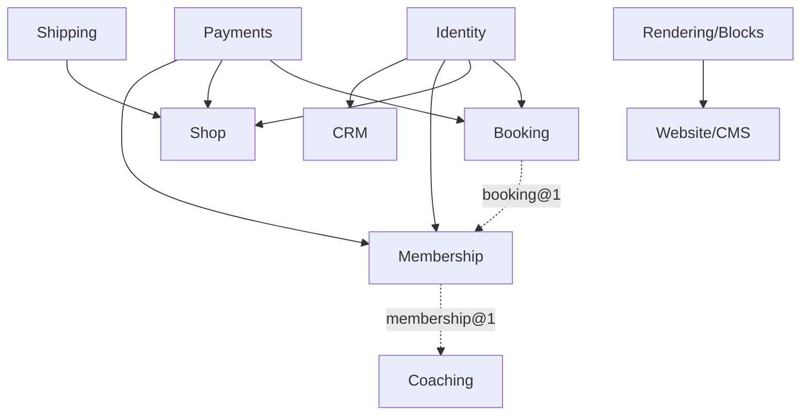

# 08 — Module Specifications

**Status:** Draft · **Applies to:** Slate v1.x → v5.x

Per-module specifications. Each shows how a vertical binds to **core services**
(Identity, Payments, Data, Rendering/Blocks, Events) instead of reinventing them —
the discipline that makes the whole platform coherent. A module is *how Slate does
a thing*; the kernel and services are *what every module reuses*.

---

## Catalogue

**Modules (verticals)** — own a bounded domain, live under `Slate\Module\*`
([Foundation Standard §1](../03-Standards/platform-foundation.md)):

| Module | Context | Consumes | Provides |
|---|---|---|---|
| [Website/CMS](website-cms.md) | Content | Rendering, Blocks, SEO, Media | pages, posts, menus, content blocks |
| [Booking](booking.md) | Scheduling | Identity, Payments, Notifications, Blocks | `booking@1`, booking blocks, `appointment.*` events |
| [Shop](shop.md) | Commerce | Identity, Payments, Shipping, Blocks | shop blocks, `order.*` events |
| [Membership](membership.md) | Commerce | Identity, Payments, `booking@1` | `membership@1`, `membership.*` events |
| [CRM](crm.md) | Identity | Identity, Events | pipeline/activities on Contacts |
| [LMS](lms.md) | Content+Commerce | Identity, Content, Payments | courses, enrollments, `course.*` events |
| [Forms](forms.md) | Communication | Data, Notifications, Events, Blocks | form block, `form.submitted` |

**Core services documented here for discoverability** — these are **not modules**;
they live under `Slate\Services\*` and expose a contract every module may consume.
They are specified in this section only because modules interact with them heavily:

| Core service | Namespace | Contract | Documented in |
|---|---|---|---|
| Notifications | `Slate\Services\Notifications` | `NotificationChannel` | [notifications.md](notifications.md) |
| Search | `Slate\Services\Search` | `SearchIndex` | [search.md](search.md) |

> Media, SEO, and Assets are likewise **core services** (`Slate\Services\Media`,
> `\Seo`, `\Assets`); their behaviour is documented where it is consumed
> ([05-Rendering](../05-Rendering/)). The rule: a **module** owns a vertical and
> its tables; a **core service** exposes a cross-cutting capability via a contract.

---

## Anatomy of a module (the template every spec follows)

1. **Purpose** — what it does, in one line.
2. **Bounded context** — where it sits in the [domain](../02-Domain/).
3. **Consumes** — core services + capabilities it depends on (`requires`).
4. **Provides** — capabilities, blocks, events it offers (`provides`).
5. **Owns** — its tables (slug-prefixed) and, crucially, **what it must NOT
   store** (it attaches a profile to `contact_id`, never a copy of a person).
6. **Routes & admin** — public routes and admin surface.
7. **Integration events** — emitted + subscribed.

---

## How modules compose

Composition is always through **capabilities and events** ([ADR-0005](../14-ADR/0005-events-and-contracts-for-modules.md)),
never direct class calls. Membership consuming `booking@1` means it resolves the
Booking capability from the container and reacts to `appointment.*` events — it
never touches Booking's tables or classes.

---

## Rules every module obeys

- Owns only its tables; references no other module's classes/tables (invariant #1).
- One `contacts` row per person; module data keyed by `contact_id` (invariant #4).
- `Money` for all amounts (invariant #3); tenant-scoped data (invariant #2).
- Declarative manifest wiring; migrations not `ensureSchema`.
- Public UI composes Components through the one pipeline (invariant #6).

See [03-Standards/module-development-standards.md](../03-Standards/module-development-standards.md).

---

## Related

- [02-Domain](../02-Domain/) · [05-Rendering](../05-Rendering/) · [06-SDK](../06-SDK/) · [07-API](../07-API/)
