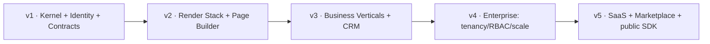

# 09 — Implementation Roadmap (v1 → v5)

**Status:** Draft · **Applies to:** Slate v1.x → v5.x

The multi-version evolution of the platform. Where the
[refactor roadmap](refactor-roadmap.md) describes getting *today's code* onto the
blueprint, this describes the *product* evolution over the next decade. Versions
are cumulative; **nothing in a later version is built before its enabling layer
exists** in an earlier one. Each version states its theme, what architecture it
establishes, and what that unlocks next.

---

## v1.x — Stable Platform Foundation *(the kernel)*

**Theme:** make the foundation stop fighting us. Mostly invisible to end users.

**Establishes:** front controller + PSR-4/namespaces; service container + module
manager v2 (declarative manifest, `provides`/`requires`, dependency resolver);
the Data Layer (repositories + migrations + automatic tenant scoping + `Money`);
the typed event bus; **unified Contacts/Identity**; Payments as a clean
`PaymentGateway`; and the meta-substrate — **git + tests + CI**.

**Unlocks:** everything below. From here a governance rule holds: *no feature
ships as an island; it targets a kernel service.*

**Maps to:** refactor Phases 0–3.

---

## v2.x — Complete Website Platform *(the render stack)*

**Theme:** build any website end-to-end, themed and SEO-complete.

**Establishes:** the full presentation subsystem — one token vocabulary, one
Component Library, the core Block Registry, first-class Sections/Templates, the
Theme Engine, the unified Rendering Pipeline, the **visual Page Builder**, the
SEO Manager (sitemap/schema/redirects), and the Asset Manager.
([04](../04-Design-System/), [05](../05-Rendering/).)

**Unlocks:** marketing sites, landing pages, blogs, and content-heavy products —
all cached, themeable, crawlable — as first-class Slate output.

**Maps to:** refactor Phase 4.

---

## v3.x — Business Platform *(verticals on the spine)*

**Theme:** run a business on one identity model.

**Establishes:** Booking, Shop, Membership, and a real **CRM**, all rebuilt on
Contacts/Identity, the Data Layer, Payments, Notifications, and Blocks — talking
via events, never each other's classes. Notifications become multi-channel +
queued; Forms unified (legacy retired); Search introduced.
([08-Modules](../08-Modules/).)

**Unlocks:** sell, book, bill, and manage relationships on one identity with
cross-module reporting — because every module shares the same person and the same
money.

---

## v4.x — Enterprise Platform *(scale & control)*

**Theme:** serve large, compliance-bound, high-volume customers.

**Establishes:** heavier tenancy drivers (schema-/DB-per-tenant) behind the
existing interface ([multi-tenancy.md](../01-Architecture/multi-tenancy.md));
resource-scoped RBAC + audit/compliance; SSO/SAML; Redis cache + queue drivers;
observability, backups, SLAs; horizontal-scaling readiness.
([10-Security](../10-Security/), [13-Operations](../13-Operations/).)

**Unlocks:** multi-team, high-volume, data-residency-bound tenants — *without*
changing any module, because the scale-sensitive concerns were interfaces from
day one (ADR-0012).

---

## v5.x — SaaS & Marketplace Ecosystem *(open the SDK)*

**Theme:** let others build on Slate.

**Establishes:** the public, semver'd **Developer SDK** as a product; a module
**marketplace** (submission, review, sandboxing, billing); self-serve tenant
provisioning; the public API + webhooks as first-class; usage metering.
([06-SDK](../06-SDK/), [07-API](../07-API/).)

**Unlocks:** a third-party ecosystem — Slate becomes a platform others build
businesses on. Only safe because v1 gave modules contracts + isolation and the
SDK a backward-compatibility policy ([03-Standards](../03-Standards/versioning-and-compatibility.md)).

---

## The through-line

Each version is the foundation the next stands on. v3's verticals are clean only
because v1 gave them one identity; v2's Page Builder exists only because the
render stack was consolidated first; v5's marketplace is safe only because v1
gave modules contracts. Skipping ahead — e.g. building CRM (v3) before identity
unification (v1) — is exactly the incremental-architecture trap this roadmap
exists to prevent.

---

## Related

- [refactor-roadmap.md](refactor-roadmap.md) · [01-Architecture](../01-Architecture/) · [14-ADR](../14-ADR/)
